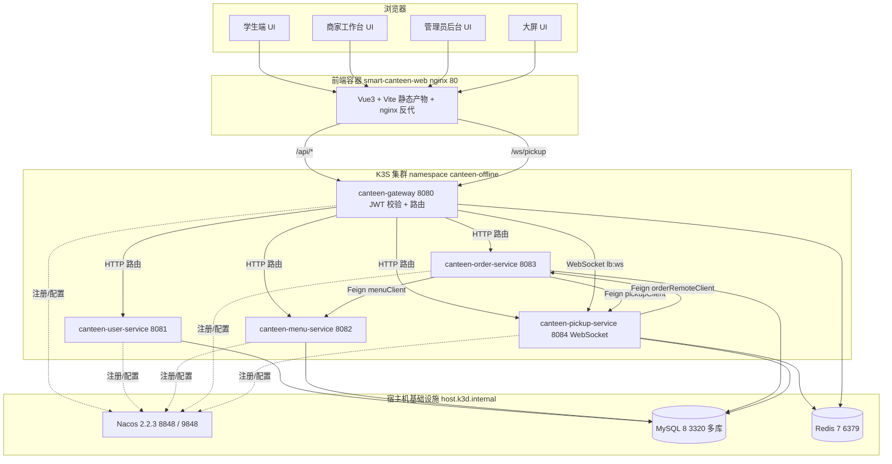
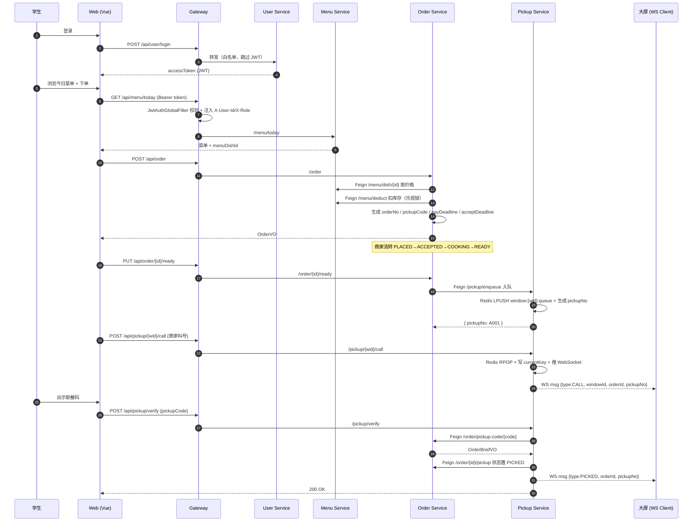
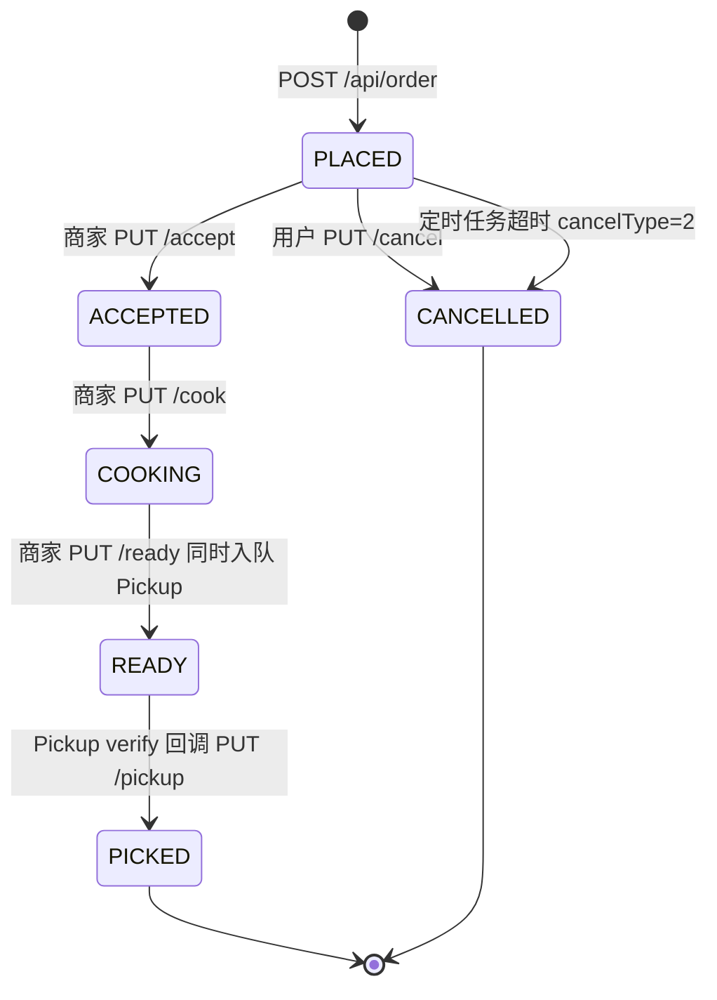
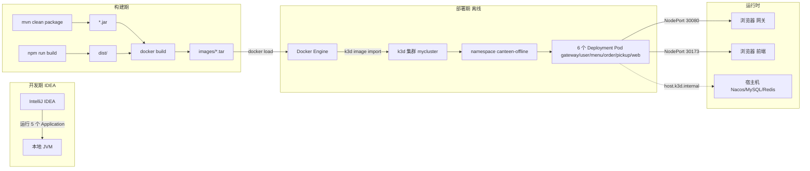

# 智能食堂点餐与取餐微服务系统 —— 架构设计文档

| 项目 | 内容 |
|------|------|
| 项目名称 | 智能食堂点餐与取餐微服务系统（smart-canteen） |
| 文档类型 | 架构设计文档 |
| 文档版本 | v1.0 |
| 评分映射 | 课程评分细则·文档部分·架构设计（10 分） |
| 适用范围 | 全部源码与部署交付物 |

---

## 1. 系统定位与目标

本系统面向校园 / 园区食堂场景，提供"在线点餐 → 商家接单备餐 → 用户取餐 → 大屏排队"的完整线上闭环。系统采用 **Spring Cloud Alibaba** 微服务架构、**K3S（k3d）容器编排**、**Vue 3 + TypeScript** 前端，演示分布式架构下的服务拆分、统一鉴权、远程调用、容器化部署等核心能力。

### 1.1 用户角色

| 角色 | 关键权限 | 关键页面 |
|------|---------|---------|
| 学生（USER） | 浏览菜单、下单、查看自己的订单、按取餐码核对 | `HomeView` 学生端、`ProfileView` |
| 商家（MERCHANT） | 创建/编辑菜品、发布每日菜单、接单/制作/完成、叫号/核销 | `HomeView` 商家工作台、`MerchantStockView` |
| 管理员（ADMIN） | 用户管理、窗口管理、全局订单查询、库存全局管控、统计大盘 | `HomeView` 管理员端、`AdminStockView` |
| 大屏（DISPLAY） | 实时显示当前叫号与等待队列（无需登录） | `PickupDisplayView` |

### 1.2 核心设计目标

- **业务领域清晰**：按 DDD 限界上下文拆分 5 个微服务，单一职责、独立部署。
- **统一入口与鉴权**：所有流量经 Gateway 进入，由 Gateway 进行 JWT 校验，下游服务直接信任 `X-User-Id / X-Role / X-Username` 三个 Header。
- **运行时可观测**：所有服务注册到 Nacos，配置由 Nacos Config 集中管理（`spring.config.import` 启用刷新）。
- **可离线部署**：通过 `k3s-version/` 离线包脚本，将后端 JAR + 前端 dist 一键打成镜像并导入 k3d 集群。

---

## 2. 架构风格与技术选型

| 维度 | 选型 | 理由 |
|------|------|------|
| 架构模式 | 微服务（Microservices） | 满足课程评分要求，便于按域独立扩展 |
| 拆分策略 | DDD 限界上下文 | 用户/菜单/订单/取餐 4 个稳定的业务边界 + 网关 |
| 服务间通信 | 同步 HTTP + Spring Cloud OpenFeign | 食堂场景调用链短、并发量有限，无需引入 MQ |
| 大屏推送 | WebSocket（`/ws/pickup`） | 商家叫号 → 大屏端低延迟接收 |
| 服务治理 | Spring Cloud Alibaba + Nacos 2.2.3 | 注册发现 + 配置中心一体化 |
| 数据存储 | MySQL 8 多库物理隔离 | 4 库分别为 `canteen_user / canteen_menu / canteen_order / canteen_pickup` |
| 缓存与队列 | Redis 7 | 取餐窗口 FIFO 队列、当前叫号、近期叫号历史 |
| 鉴权 | JJWT 0.12.5（HS256） | 无状态，便于多实例水平扩展 |
| 容器编排 | K3S（k3d v1.31.5-k3s1） | 满足课程评分要求，本地一键起 |
| 前端 | Vue 3.5 + Vite 5 + TS 5 + Pinia + Element Plus | 学生 / 商家 / 管理员 / 大屏一套代码四类视图 |

依据：版本与端口清单见仓库 [README.md](../../README.md) 第 23–46 行；后端依赖见 [smart-canteen/pom.xml](../../smart-canteen/pom.xml)。

---

## 3. 总体架构图（C4 — Container 视图）



### 3.1 路由与转发规则

Gateway 路由表来自 [canteen-gateway/application.yml](../../smart-canteen/canteen-gateway/src/main/resources/application.yml) 第 28–68 行：

| 入口 Path | 转发到 | StripPrefix |
|-----------|--------|-------------|
| `/api/user/**` | `lb://canteen-user-service` | 1 |
| `/api/dish/**` | `lb://canteen-menu-service` | 1 |
| `/api/menu/**` | `lb://canteen-menu-service` | 1 |
| `/api/order/**` | `lb://canteen-order-service` | 1 |
| `/api/stat/**` | `lb://canteen-order-service` | 1 |
| `/api/pickup/**` | `lb://canteen-pickup-service` | 1 |
| `/ws/pickup/**` | `lb:ws://canteen-pickup-service` | — |

`StripPrefix=1` 表示在转发前去掉首段 `/api`，所以下游 controller 用 `/user`、`/menu`、`/dish`、`/order`、`/pickup`、`/stat` 作为 `@RequestMapping`。

---

## 4. 核心调用链路

### 4.1 下单 → 制作 → 取餐全流程时序



### 4.2 订单状态机

订单状态由 [OrderStatus.java](../../smart-canteen/canteen-order-service/src/main/java/com/canteen/order/constant/OrderStatus.java) 定义，整型常量 0~5：



超时逻辑由 [OrderTimeoutScheduler.java](../../smart-canteen/canteen-order-service/src/main/java/com/canteen/order/scheduler/OrderTimeoutScheduler.java) 每 30 秒扫描一次，命中 `payDeadline < now` 或 `acceptDeadline < now` 的 PLACED 订单批量取消并通过 `MenuClient.restore` 还原库存。

### 4.3 取餐队列结构（Redis）

每个窗口在 Redis 中维护 3 个 key（[PickupQueueService.java:279–289](../../smart-canteen/canteen-pickup-service/src/main/java/com/canteen/pickup/service/PickupQueueService.java)）：

| Key 模板 | 类型 | 用途 |
|---------|------|------|
| `window:{wid}:queue` | List | 等待叫号队列；`LPUSH` 入队，`RPOP` 出队（FIFO） |
| `window:{wid}:current` | String | 当前正在叫号的 orderId |
| `window:{wid}:history` | List | 最近 20 条叫号 pickupNo（`LTRIM 0 19`） |
| `window:{wid}:seq` | Counter | 取餐号自增序列，`pickupNo = prefix + seq%1000`（如 `A001`） |

---

## 5. 关键技术决策

### 5.1 Gateway 统一 JWT 鉴权

实现在 [JwtAuthGlobalFilter.java](../../smart-canteen/canteen-gateway/src/main/java/com/canteen/gateway/filter/JwtAuthGlobalFilter.java)：

```java
private static final List<String> WHITELIST = List.of(
        "/api/user/register",
        "/api/user/login",
        "/api/user/refresh"
);
// ...
if (!JwtUtil.validateToken(jwtSecret, token)) {
    return unauthorized(exchange, "Token无效或已过期");
}
ServerHttpRequest mutated = exchange.getRequest().mutate()
        .header(UserHeaders.USER_ID, String.valueOf(userId))
        .header(UserHeaders.USERNAME, username)
        .header(UserHeaders.ROLE, role)
        .build();
```

要点：

- **白名单**：注册 / 登录 / 刷新接口免校验；`/ws/*` 路径直接放行（WebSocket 由前端在握手时自带 token，业务层独立校验）。
- **Token 失败统一响应**：返回 `Result{code:401,msg:"Token无效或已过期"}`，HTTP 状态 401。
- **下游服务零重复鉴权**：所有下游 controller 直接 `request.getHeader("X-User-Id")` 即可拿到用户身份；角色判断使用 `RoleNames` 字符串常量（`USER` / `MERCHANT` / `ADMIN`）。
- **GlobalFilter 优先级**：`getOrder()` 返回 `-100`，确保比内置过滤器更早执行。

### 5.2 库存扣减并发控制 —— 数据库乐观锁

未引入分布式锁。在 [MenuDishMapper.java:15](../../smart-canteen/canteen-menu-service/src/main/java/com/canteen/menu/mapper/MenuDishMapper.java) 直接通过 SQL 条件保证不超卖：

```sql
UPDATE menu_dish
SET stock = stock - #{qty}, sold = sold + #{qty}
WHERE id = #{id} AND deleted = 0 AND stock >= #{qty}
```

返回 `affectedRows == 0` 即视为库存不足，抛 `STOCK_NOT_ENOUGH(2002)`。回退操作 `restoreStock` 同样带 `sold >= #{qty}` 条件，杜绝负值。理由：食堂并发量有限，单条 UPDATE 已经能保证一致性，比 Redis 分布式锁更轻量。

### 5.3 取餐排队 —— Redis List FIFO

商家"完成制作"动作触发 `LPUSH`，"叫号"动作触发 `RPOP`，天然 FIFO。叫号同时：

1. 写入 `currentKey` 标记当前正在被叫号的订单；
2. 把 pickupNo 推入 `historyKey` 并 `LTRIM` 到 20；
3. 通过 `WebSocketBroadcaster.broadcast(json)` 向所有连接的大屏会话广播 JSON 消息。

### 5.4 服务间调用 —— Spring Cloud OpenFeign

- **Order → Menu**：[MenuClient.java](../../smart-canteen/canteen-order-service/src/main/java/com/canteen/order/client/MenuClient.java) 提供 `getMenuDish / deduct / restore`。
- **Order → Pickup**：[PickupClient.java](../../smart-canteen/canteen-order-service/src/main/java/com/canteen/order/client/PickupClient.java) 提供 `enqueue / windows`。
- **Pickup → Order**：`OrderRemoteClient` 提供 `findByPickupCode / pickupDone`。

所有 Feign 接口通过 Nacos 服务发现自动负载均衡（`@FeignClient(name = "canteen-xxx-service")`）。

### 5.5 WebSocket 推送

- 端点：`/ws/pickup`（在 [WebSocketConfig.java](../../smart-canteen/canteen-pickup-service/src/main/java/com/canteen/pickup/websocket/WebSocketConfig.java) 注册）。
- 单实例广播：使用 `CopyOnWriteArraySet<WebSocketSession>` 维护会话集合（[WebSocketBroadcaster.java](../../smart-canteen/canteen-pickup-service/src/main/java/com/canteen/pickup/websocket/WebSocketBroadcaster.java)）。
- 消息协议：`{"type":"CALL"|"PICKED","windowId":...,"orderId":...,"pickupNo":"A001"}`。
- 集群扩展方向：当 pickup 实例 ≥2 时，需引入 Redis Pub/Sub 把广播放大到所有实例（当前评分要求未涉及）。

### 5.6 Token 刷新

[UserService.refresh](../../smart-canteen/canteen-user-service/src/main/java/com/canteen/user/service/UserService.java)：

- 允许在 Token 过期 7 天宽限期内刷新（`exp + 7d > now`）；
- 颁发新 Token 时携带最新用户角色与昵称；
- 用户被禁用（`status = 0`）则刷新失败。

### 5.7 配置中心 —— Nacos Config

每个服务的 `application.yml` 都启用：

```yaml
spring:
  config:
    import: optional:nacos:${spring.application.name}.yml?group=DEFAULT_GROUP&refreshEnabled=true
```

模板见 `nacos/canteen-*.yml`，K3S 部署时通过环境变量 `SPRING_CLOUD_NACOS_*` 把地址改成 `host.k3d.internal:8848`，业务侧零改动。

---

## 6. 部署架构



详见 [02-K3S部署方案说明.md](02-K3S部署方案说明.md)。

---

## 7. 非功能需求落地

| 需求 | 量化指标 | 实现策略 |
|------|---------|---------|
| 性能 | 单接口 P95 < 500 ms | 数据库表关键字段建索引（`order_no / pickup_code / pay_deadline` 等）；Redis 直接读队列；Feign 默认 1 s 超时 |
| 可用性 | 单服务故障不致全局瘫痪 | 网关返回业务码；Feign 调用失败抛 `BusinessException` 由 `GlobalExceptionHandler` 转 500 业务码；订单创建侧失败自动回滚库存（[OrdersAppService.create](../../smart-canteen/canteen-order-service/src/main/java/com/canteen/order/service/OrdersAppService.java) `restoreStocks`） |
| 安全 | 接口防未授权 / 防越权 | 统一 JWT 校验；下游 service 按 `X-Role` 显式判定；管理员账号不可被删除（user-service 硬编码保护） |
| 一致性 | 订单 / 库存最终一致 | DB 事务内组合 `UPDATE … WHERE stock >= ?` + 业务回退；`@Transactional` 控制本地事务 |
| 可扩展性 | 服务可独立水平扩展 | Nacos 服务发现 + Spring Cloud LoadBalancer；除 Pickup WebSocket 外均为无状态服务 |
| 可维护性 | 跨服务行为统一 | `Result / StatusCode / BusinessException / JwtUtil / RoleNames / UserHeaders` 收敛在 `canteen-common`；每服务都装载 `GlobalExceptionHandler` 把异常转为统一 `Result` |

---

## 8. 风险与应对

| 风险 | 影响 | 应对 |
|------|------|------|
| Pickup 多实例时 WebSocket 仅本实例广播 | 部分大屏收不到叫号 | 当前评分要求单实例；后续接 Redis Pub/Sub 跨实例广播 |
| Feign 调用 Menu 扣库存成功但订单写 DB 失败 | 库存被错扣 | `OrdersAppService.create` 用 `try/catch` 在 RuntimeException 时调用 `restoreStocks` 反向恢复 |
| JWT secret 泄露 | 越权风险 | 当前为开发常量；生产环境需走 Nacos 密文配置或 KMS |
| K3d Pod 内 `127.0.0.1` 无法访问宿主机服务 | 服务无法注册 | 部署 YAML 用 `host.k3d.internal` 注入环境变量覆盖 |
| 订单超时定时任务漏单 | 库存被长期占用 | 30 秒扫描一次 + `LIMIT 100` 分批；定时任务异常被 `try/catch` 吞下并打 `WARN` 日志 |

---

## 9. 文档与代码索引

| 主题 | 入口 |
|------|------|
| 顶层 README | [README.md](../../README.md) |
| 数据库初始化 | [database_init/init.sql](../../database_init/init.sql) |
| Gateway 路由表 | [smart-canteen/canteen-gateway/src/main/resources/application.yml](../../smart-canteen/canteen-gateway/src/main/resources/application.yml) |
| 全局异常处理 | 各服务 `config/GlobalExceptionHandler.java` |
| K3S 离线部署 | [k3s-version/README.md](../../k3s-version/README.md) |
| 测试脚本 | [tests/](../../tests/) |
