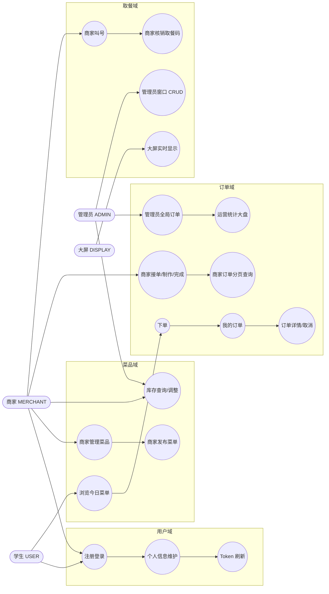
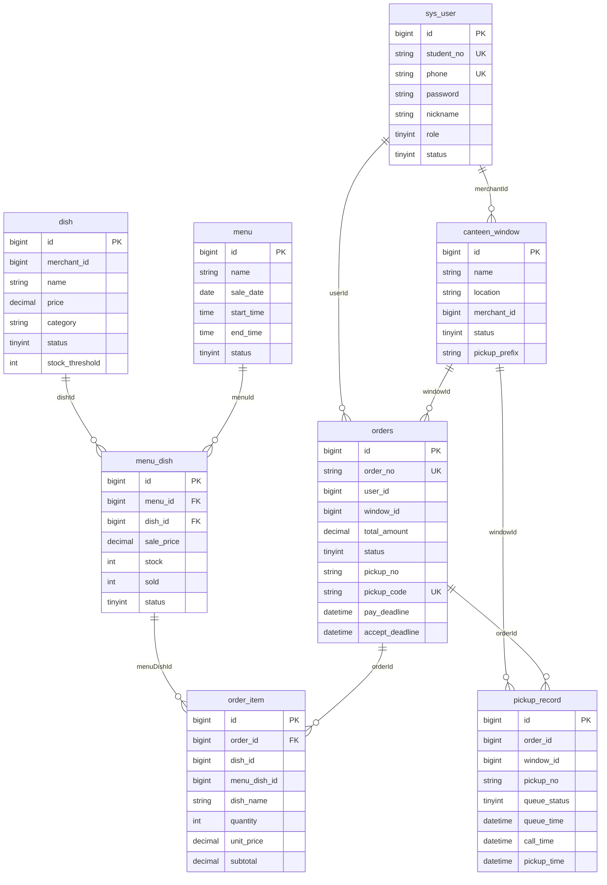

# 智能食堂点餐与取餐微服务系统 —— 需求规格说明书（SRS）

| 项目 | 内容 |
|------|------|
| 项目名称 | 智能食堂点餐与取餐微服务系统（smart-canteen） |
| 文档类型 | 需求规格说明书（SRS） |
| 文档版本 | v1.0 |
| 评分映射 | 课程评分细则·文档部分·软件工程文档（30 分）·需求规格说明书 |
| 适用读者 | 课程评审、开发、测试、运维 |

---

## 1. 引言

### 1.1 编写目的

本文档明确"智能食堂点餐与取餐微服务系统"的功能与非功能需求，作为后续概要设计、详细设计、测试用例的输入。

### 1.2 项目范围

- **范围内**：用户注册登录、菜品管理、菜单发布、库存控制、下单与状态机、取餐排队叫号、大屏推送、统一网关、JWT 鉴权、K3S 部署。
- **范围外**：在线支付、配送、发票、订单评价、消息推送（短信 / 邮件）、复杂报表、第三方登录。

### 1.3 名词定义

| 术语 | 含义 |
|------|------|
| 用户 / 学生（USER） | 普通就餐者，对应 `sys_user.role = 0` |
| 商家（MERCHANT） | 食堂档口运营者，对应 `sys_user.role = 1` |
| 管理员（ADMIN） | 系统管理员，对应 `sys_user.role = 2` |
| 窗口 | 取餐档口，一对一绑定一个商家，物理上一个排队位置 |
| 取餐号（pickupNo） | 大屏可见的叫号，如 `A001`，由窗口前缀 + Redis 自增序号生成 |
| 取餐码（pickupCode） | 6 位数字唯一码，用于商家核销取餐，下单时生成 |
| 菜单（menu） | 某天某时段可售的菜品集合 |
| 当日菜单菜品（menu_dish） | 关联表，记录每日菜单中具体菜品的售价、库存、已售数量 |

---

## 2. 总体描述

### 2.1 产品愿景

围绕"扫码点餐 → 商家备餐 → 大屏叫号 → 取餐核销"四步闭环，提供低延迟、可水平扩展、易于离线部署的微服务范例。

### 2.2 用户角色与典型用例



### 2.3 运行环境

| 项 | 内容 |
|---|---|
| 操作系统 | Windows 11 / Linux 任意发行版 |
| 容器运行时 | Docker Desktop / Docker Engine |
| 编排 | K3S（k3d v1.31.5-k3s1） |
| Java 运行时 | JDK 17 LTS |
| 数据库 | MySQL 8 |
| 缓存 | Redis 7 |
| 注册中心 | Nacos 2.2.3 |
| 浏览器 | 现代浏览器（Chrome / Edge / Firefox 最新版） |

---

## 3. 功能需求

### 3.1 用户服务（canteen-user-service）

| 编号 | 名称 | 角色 | 描述 | 关键约束 |
|------|------|------|------|---------|
| FR-U-01 | 用户注册 | 匿名 | 通过手机号 + 密码 + 学工号注册账号 | 手机号、学工号唯一；密码 BCrypt 加密；默认角色 `USER` |
| FR-U-02 | 用户登录 | 匿名 | 凭手机号 + 密码登录，颁发 JWT | 失败计数策略未实现；返回 `accessToken / tokenType / expiresIn / userId / role` |
| FR-U-03 | Token 刷新 | 已登录 | 在过期 7 天宽限期内可换取新 Token | 携带 `Authorization: Bearer ...` |
| FR-U-04 | 查询当前用户 | 已登录 | `GET /api/user/me` 返回个人信息 | — |
| FR-U-05 | 修改个人信息 | 已登录 | 更新昵称、头像 URL | — |
| FR-U-06 | 修改密码 | 已登录 | 校验旧密码后更新；新旧不能相同 | 6–20 位 |
| FR-U-07 | 用户列表 | ADMIN | 支持按角色/状态/手机/昵称/学工号过滤分页 | 越权返回 `403` |
| FR-U-08 | 启用/禁用用户 | ADMIN | `PUT /{id}/status?value=0|1` | 禁用后登录返回 `403` |
| FR-U-09 | 删除用户 | ADMIN | 软删除 `sys_user.deleted = 1` | 管理员账号不可删除 |
| FR-U-10 | 重置密码 | ADMIN | `POST /{id}/reset-password` 设置任意密码 | 6–20 位 |

### 3.2 菜品与菜单服务（canteen-menu-service）

| 编号 | 名称 | 角色 | 描述 | 关键约束 |
|------|------|------|------|---------|
| FR-M-01 | 创建菜品 | MERCHANT/ADMIN | 名称、分类、单价、图片、描述、库存预警阈值 | `merchant_id` 自动取自登录用户 |
| FR-M-02 | 更新菜品 | MERCHANT/ADMIN | 修改字段；菜品被生效菜单引用时返回 `3008` | — |
| FR-M-03 | 上下架菜品 | MERCHANT/ADMIN | `PUT /{id}/status?value=0|1` | 下架不影响已下单订单 |
| FR-M-04 | 删除菜品 | MERCHANT/ADMIN | 软删除；被生效菜单引用时返回 `3008` | — |
| FR-M-05 | 菜品分页查询 | 任意 | 支持 `merchantId/name/category/status/minPrice/maxPrice` | 学生端只看上架 |
| FR-M-06 | 发布菜单 | MERCHANT/ADMIN | 发布某日某时段的菜单及含若干 menu_dish | 含 `salePrice / stock / sold = 0` |
| FR-M-07 | 今日菜单 | 任意 | `GET /api/menu/today` 仅返回当天且当前时间在 `[startTime, endTime]` 内的菜单 | 用户下单的入口 |
| FR-M-08 | 菜单详情 | 任意 | `GET /api/menu/{id}` | — |
| FR-M-09 | 菜单分页查询 | 任意 | 支持 `name/merchantId/saleDate/status/startDate/endDate` | — |
| FR-M-10 | 菜单/菜单菜品管理 | ADMIN | `PUT /api/menu/{id}` `PUT /api/menu/{id}/status` `DELETE /api/menu/{id}` `PUT /api/menu/dish/{menuDishId}` | — |
| FR-M-11 | 菜单菜品详情 | 任意 | `GET /api/menu/dish/{menuDishId}` 返回 dishName/salePrice/stock 等 | 订单服务下单时调用 |
| FR-M-12 | 库存查询（商家） | MERCHANT | `GET /api/menu/stock/merchant` 仅返回自己 dish 关联的 menu_dish | — |
| FR-M-13 | 库存查询（管理员） | ADMIN | `GET /api/menu/stock/list` 支持 `lowStockOnly` 仅看低于阈值 | — |
| FR-M-14 | 库存调整 | MERCHANT/ADMIN | `PUT /api/menu/stock/{menuDishId}`，`op = SET / INCR / DECR`，校验冲突 | 越权 `403`；冲突 `2002 / 2004` |
| FR-M-15 | 库存原子扣减 | 内部（订单服务调用） | `POST /api/menu/deduct` 乐观锁 | 失败抛 `2002` |
| FR-M-16 | 库存原子恢复 | 内部 | `POST /api/menu/restore` | — |

### 3.3 订单服务（canteen-order-service）

| 编号 | 名称 | 角色 | 描述 | 关键约束 |
|------|------|------|------|---------|
| FR-O-01 | 下单 | USER | 提交 `windowId + items[{menuDishId,quantity}]` | 自动调用 menu-service 取价 + 扣库存；生成 `orderNo / pickupCode / payDeadline=15min / acceptDeadline=30min`；失败回滚已扣库存 |
| FR-O-02 | 订单详情 | USER（自己）/ADMIN | `GET /api/order/{id}` | 越权返回 `403` |
| FR-O-03 | 我的订单 | USER | 分页查询自己创建的订单 | 倒序展示 |
| FR-O-04 | 用户取消 | USER | 仅 `PLACED` 可取消，`cancelType=1` | 状态非法返回 `3002`；同步恢复库存 |
| FR-O-05 | 商家接单 | MERCHANT | `PLACED → ACCEPTED` | — |
| FR-O-06 | 商家制作 | MERCHANT | `ACCEPTED → COOKING` | — |
| FR-O-07 | 商家完成（待取餐） | MERCHANT | `COOKING → READY` 同时调用 pickup `enqueue` 入队并写回 `pickupNo` | enqueue 失败抛 `500`；状态非法返回 `3002` |
| FR-O-08 | 商家订单分页 | MERCHANT | `GET /api/order/merchant`，仅查自己负责的窗口；支持 status/windowId/keyword/dateFrom/dateTo | 越权 `403` |
| FR-O-09 | 管理员全局订单 | ADMIN | `GET /api/order/list`，支持 merchantId/windowId/userId 等 | 越权 `403` |
| FR-O-10 | 按取餐码查询 | 任意鉴权 | `GET /api/order/pickup-code/{code}` | 不存在返回 `3001` |
| FR-O-11 | 取餐回调 | 内部（pickup 调用） | `PUT /api/order/{id}/pickup`，`READY → PICKED` | 状态非法返回 `3002` |
| FR-O-12 | 订单备注 | MERCHANT | `POST /api/order/{id}/remark?remark=...` | — |
| FR-O-13 | 批量改状态 | MERCHANT | `POST /api/order/batch/status` 批量推进 | 缺参数返回 `400` |
| FR-O-14 | 商家统计大盘 | MERCHANT | `GET /api/stat/merchant/dashboard` 返回 totalOrders / placedOrders / readyOrders / doneOrders | — |
| FR-O-15 | 管理员统计大盘 | ADMIN | `GET /api/stat/admin/dashboard` | — |
| FR-O-16 | 订单超时自动取消 | 系统 | 每 30s 扫描 `payDeadline < now` 或 `acceptDeadline < now` 的 `PLACED` 订单，批量取消并恢复库存（`cancelType=2`） | 批次 `LIMIT 100` |

### 3.4 取餐与排队服务（canteen-pickup-service）

| 编号 | 名称 | 角色 | 描述 | 关键约束 |
|------|------|------|------|---------|
| FR-P-01 | 创建窗口 | MERCHANT/ADMIN | 名称、位置、商家、取餐号前缀 | 默认前缀 `A` |
| FR-P-02 | 更新窗口 | ADMIN | 修改名称/位置/前缀/商家 | — |
| FR-P-03 | 启用/关闭窗口 | ADMIN | `value = 0/1` | — |
| FR-P-04 | 删除窗口 | ADMIN | 该窗口存在等待中或已叫号订单时拒绝 | 业务码 `4090` |
| FR-P-05 | 窗口分页查询 | 任意鉴权 | 支持 `status/merchantId/keyword` | — |
| FR-P-06 | 入队（内部） | 内部（订单服务调用） | 生成 `pickupNo = prefix + (seq%1000).PAD3`，`LPUSH window:{wid}:queue` | 窗口关闭时返回 `404` |
| FR-P-07 | 商家叫号 | MERCHANT | `RPOP` 取队首，更新 `currentKey`、写入 `historyKey LTRIM 0 19`，发 WebSocket | 队列为空返回 `4002` |
| FR-P-08 | 取餐核销 | MERCHANT | `POST /api/pickup/verify`，校验 `pickupCode + 订单状态 == READY` 后调用 order `PUT /pickup` | 校验失败 `4003` / 状态错 `3002` |
| FR-P-09 | 队列查询 | 任意鉴权 | `GET /api/pickup/{wid}/queue` 列出等待 orderId | — |
| FR-P-10 | 大屏数据 | 任意鉴权 | `GET /api/pickup/{wid}/display` 返回 currentPickupNo / waitingCount / waitingOrderIds / recentCalls | — |
| FR-P-11 | WebSocket 推送 | 系统 | 端点 `/ws/pickup`，叫号 `{type:CALL, ...}`，核销 `{type:PICKED, ...}` | 单实例广播 |
| FR-P-12 | 窗口历史 | 任意鉴权 | `GET /api/pickup/window/{id}/history` 最近 100 条 | — |

### 3.5 网关（canteen-gateway）

| 编号 | 名称 | 描述 |
|------|------|------|
| FR-G-01 | 路由转发 | 按 [application.yml](../../smart-canteen/canteen-gateway/src/main/resources/application.yml) 第 28–68 行规则路由 |
| FR-G-02 | JWT 校验 | `JwtAuthGlobalFilter` 校验 `Authorization: Bearer ...`；失败 401 |
| FR-G-03 | 白名单 | `/api/user/register`、`/api/user/login`、`/api/user/refresh`、`/ws/*` 跳过校验 |
| FR-G-04 | 身份注入 | 校验通过后写入 `X-User-Id / X-Username / X-Role` |
| FR-G-05 | WebSocket 代理 | `/ws/pickup/**` 转发到 pickup-service 的 `/ws/pickup` |
| FR-G-06 | 跨域 | 全局 CORS 允许任意 origin / method / header |
| FR-G-07 | 限流 | 通过 `rate-limit.*` 配置项预留 IP 级 / 用户级限流参数（评分要求 P1 范畴，目前以配置占位） |
| FR-G-08 | 异常统一返回 | 内部错误透传业务码；网关层 401 直接构造 `Result` JSON |

### 3.6 前端（smart-canteen-web）

| 编号 | 名称 | 描述 |
|------|------|------|
| FR-W-01 | 登录 / 注册 | `LoginView` `RegisterView` 调用 `/api/user/login` `/register` |
| FR-W-02 | 个人中心 | `ProfileView`：查看 / 修改昵称 / 头像 / 修改密码 / 刷新 Token |
| FR-W-03 | 学生端首页 | 今日菜单展示、下单、我的订单 |
| FR-W-04 | 商家端 | 订单流转、叫号 / 核销面板、菜品 / 菜单管理、库存调整 |
| FR-W-05 | 管理员端 | 用户管理、窗口管理、全局订单、库存全局视图、统计大盘 |
| FR-W-06 | 大屏 | `PickupDisplayView` 建立 WebSocket，实时显示叫号 |

---

## 4. 非功能需求

### 4.1 性能

| 指标 | 要求 |
|------|------|
| 单接口 P95 响应时间 | < 500 ms（典型负载 50 并发） |
| 网关吞吐 | ≥ 200 RPS（单实例） |
| 数据库连接池 | HikariCP 默认 10，可在 Nacos 中调整 |
| 取餐叫号 → 大屏到达 | < 1 s（同机房局域网） |

### 4.2 可用性 & 可靠性

- 单微服务故障不影响登录与基础查询；
- Feign 调用失败抛 `BusinessException`，由 GlobalExceptionHandler 转 `Result.error`，不向前端泄露堆栈；
- 订单创建失败保证库存反向恢复；
- 订单超时定时任务异常被吞下并 `WARN` 日志，下一周期再尝试。

### 4.3 安全性

| 主题 | 策略 |
|------|------|
| 鉴权 | JWT HS256；Token 默认 24 小时 |
| 越权 | 下游接口按 `X-Role` 二次校验：`MERCHANT` 仅看自己关联的窗口订单；管理员接口要求 `ADMIN` |
| 密码存储 | BCrypt 单向加密 |
| 敏感字段 | 不在响应体返回 `password`、`deleted` 等内部字段 |
| 资源标识 | 所有 PathVariable 限定为 Long / 受控字符串，避免路径穿越 |
| 跨域 | 网关统一允许 `allowCredentials: true`，前后端同源时无误 |

### 4.4 可扩展性

- 服务全部无状态（除 pickup-service 维护 WebSocket session），可水平扩展；
- 新增菜品 / 窗口 / 商家不需改代码或重启；
- Nacos 动态配置 `refreshEnabled=true`，可在线变更 `jwt.expiration`、`rate-limit.*` 等参数。

### 4.5 可维护性

- 公共代码统一在 `canteen-common`：`Result / StatusCode / BusinessException / JwtUtil / RoleNames / UserHeaders / BaseEntity`；
- 异常处理统一在 `config/GlobalExceptionHandler`；
- 命名约定：表名小写下划线、Java 类驼峰、REST URL 小写连字符或单词；
- 日志：生产环境通过 `application.yml` 调整等级，关键链路（登录、下单、叫号）打 INFO。

### 4.6 可部署性

- 离线打包 + 一键部署（见 [02-K3S部署方案说明.md](02-K3S部署方案说明.md)）；
- 环境变量覆盖配置，支持同一 jar 跑多环境。

### 4.7 国际化与本地化

- 当前仅简体中文；
- 错误信息均为中文，可通过 Nacos 配置或 i18n 包后续扩展。

---

## 5. 接口需求

### 5.1 协议与格式

- HTTP/1.1，`Content-Type: application/json; charset=utf-8`；
- 鉴权：`Authorization: Bearer <jwt>`；
- 响应统一结构：

```json
{
  "code": 200,
  "msg": "操作成功",
  "data": {},
  "timestamp": 1714291200000
}
```

### 5.2 业务码体系

来自 [StatusCode.java](../../smart-canteen/canteen-common/src/main/java/com/canteen/common/result/StatusCode.java)：

| 范围 | 含义 | 典型场景 |
|------|------|---------|
| `200` | 成功 | 所有正常返回 |
| `400` | 参数错误 | `@Valid` 校验失败 / 业务参数不全 |
| `401` | 未授权 | 缺 Token / Token 失效 |
| `403` | 禁止访问 | 越权调用 / 用户被禁用 |
| `404` | 资源不存在 | 窗口 / 菜品不存在 |
| `500` | 系统内部错误 | 未捕获异常 |
| `1002` | 用户不存在 | 登录时找不到手机号 |
| `1003` | 用户已存在 | 注册时手机号或学工号冲突 |
| `1004` | 密码错误 | 登录密码不匹配 |
| `1005` | 登录已失效 | 刷新 Token 已过 7 天宽限 |
| `2002` | 库存不足 | 下单 / DECR 操作扣减失败 |
| `2003` | 菜单或菜品不存在 | menuDishId 无效 |
| `2004` | 库存状态冲突 | `SET` 值小于已售 / 状态机不允许 |
| `3001` | 订单不存在 | 按 id / pickupCode 查不到 |
| `3002` | 订单状态不允许此操作 | 非 `PLACED` 调用 cancel 等 |
| `3008` | 菜品被生效菜单引用，不可修改 | 改 / 下架 / 删菜品被阻拦 |
| `4002` | 当前队列无订单 | 空队列叫号 |
| `4003` | 取餐码校验失败 | 错误 / 已使用 |
| `4090` | 数据冲突 | 唯一约束 / 删窗口时活动订单未清 |

### 5.3 分页规范

请求参数：`page` (默认 1), `size` (默认 10)。响应：

```json
{
  "records": [],
  "total": 0,
  "current": 1,
  "size": 10,
  "pages": 0
}
```

### 5.4 时间范围

`dateFrom`、`dateTo` 同时支持 `yyyy-MM-dd`（按整天）与 ISO `yyyy-MM-ddTHH:mm:ss`（精确时间）；具体解析见 [OrdersAppService.parseStartTime/parseEndTime](../../smart-canteen/canteen-order-service/src/main/java/com/canteen/order/service/OrdersAppService.java)。

### 5.5 关键词

`keyword` 字段在订单服务中模糊匹配 `order_no / pickup_code / order_item.dish_name`；菜单与库存中匹配 `menu.name / dish.name / window.name / location`。

### 5.6 主要 endpoint 一览

完整接口签名见 [04-概要设计说明书.md](04-概要设计说明书.md) §4 与 [05-详细设计说明书.md](05-详细设计说明书.md)。

---

## 6. 数据需求

### 6.1 数据库分库

按服务物理隔离 4 个库（[database_init/init.sql](../../database_init/init.sql)）：



### 6.2 关键索引

| 表 | 索引 | 用途 |
|----|------|------|
| `sys_user` | `phone`, `student_no` UNIQUE | 注册/登录唯一性 |
| `orders` | `idx_user`, `idx_window`, `idx_status`, `idx_order_no`, `idx_pickup_code`, `idx_pay_deadline`, `idx_accept_deadline` | 多维度查询 / 超时扫描 |
| `menu_dish` | `uk_menu_dish (menu_id, dish_id) UNIQUE` | 同菜单同菜品唯一 |
| `pickup_record` | `idx_order`, `idx_window`, `idx_queue_status`, `idx_pickup_no` | 队列回查 |

### 6.3 Redis 数据结构

| Key 模板 | 类型 | 说明 |
|---------|------|------|
| `window:{wid}:queue` | List | 等待叫号的 orderId（FIFO） |
| `window:{wid}:current` | String | 当前叫号 orderId |
| `window:{wid}:history` | List | 最近 20 条 pickupNo |
| `window:{wid}:seq` | String/Counter | 取餐号自增序列 |

### 6.4 数据保留策略

- `sys_user / dish / menu / menu_dish / orders / order_item / pickup_record / canteen_window` 全部启用逻辑删除（`deleted` 字段，配置见 user-service `application.yml` 第 31–35 行）；
- Redis 队列不做 TTL，由叫号 / 核销自然消费；服务重启后队列保留。

---

## 7. 约束条件

### 7.1 技术约束

- Java 17 + Spring Boot 3.2.5 + Spring Cloud 2023.0.1 + Spring Cloud Alibaba 2023.0.1.0；
- MySQL 8、`com.mysql.cj.jdbc.Driver`；
- MyBatis-Plus 3.5.6（Spring Boot 3 兼容版）；
- 单一打包形式 fat jar，使用 `eclipse-temurin:17-jre` 运行；
- 评分要求 K3S 部署，未要求 K8s 高可用集群。

### 7.2 业务约束

- 同一手机号 / 学工号只能注册一个用户；
- 一个商家可以管理多个窗口，但一个窗口仅绑定一个商家；
- 同一菜品同一菜单只能有 1 条 `menu_dish`；
- 取餐码 6 位数字，全局唯一（最多重试 15 次生成）；
- 订单从下单到 `READY` 之前可被用户取消；`READY` 之后只能由商家核销或继续等待；
- 订单超时统一标记 `cancelType = 2`（"支付/接单超时"，与 init.sql 中的 1=用户、2=支付超时、3=商家超时未接单 不完全对应——当前实现把支付与商家未接单合并到 `cancelType=2`，详见 [05 详细设计](05-详细设计说明书.md)）。

### 7.3 部署约束

- 部署节点须能够通过 `host.k3d.internal` 访问宿主机的 Nacos / MySQL / Redis；
- pickup-service 副本数固定为 1（WebSocket 单实例广播限制）；
- 网关 NodePort 30080、前端 NodePort 30173 不与宿主机端口冲突。

### 7.4 法律与合规

- 当前未涉及个人敏感信息存储（不含身份证、银行卡）；
- 测试 / 演示账号见 [tests/后端接口测试手册.md](../../tests/后端接口测试手册.md) §2.2，仅供本地使用。

---

## 8. 验收标准

| 类别 | 验收点 |
|------|------|
| 服务存在 | 5 个 Spring Boot 服务全部能在 Nacos 控制台注册成功 |
| API 通畅 | 全部 P0 接口（用户登录、菜单浏览、下单、商家流转、取餐核销）按测试手册返回 `code: 200` |
| 状态机 | 订单状态严格 `PLACED → ACCEPTED → COOKING → READY → PICKED`，越级返回 `3002` |
| 库存一致性 | 下单失败时 `menu_dish.stock + sold` 与初始一致；并发同时下单不会出现负库存 |
| 大屏推送 | 商家叫号后 1 秒内大屏 WebSocket 收到 `type: CALL` 消息 |
| 鉴权 | 无 Token 访问业务接口返回 401；越权访问 ADMIN 接口返回 403 |
| 部署 | 按 [02-K3S部署方案说明.md](02-K3S部署方案说明.md) 一键脚本部署完成后浏览器可访问前端与网关 |

详细测试用例与执行结果见 [06-测试用例.md](06-测试用例.md)、[07-测试报告.md](07-测试报告.md)。
