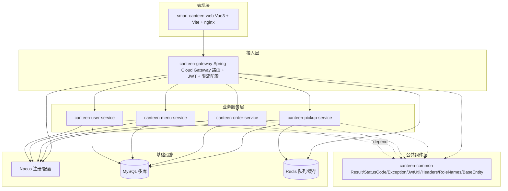
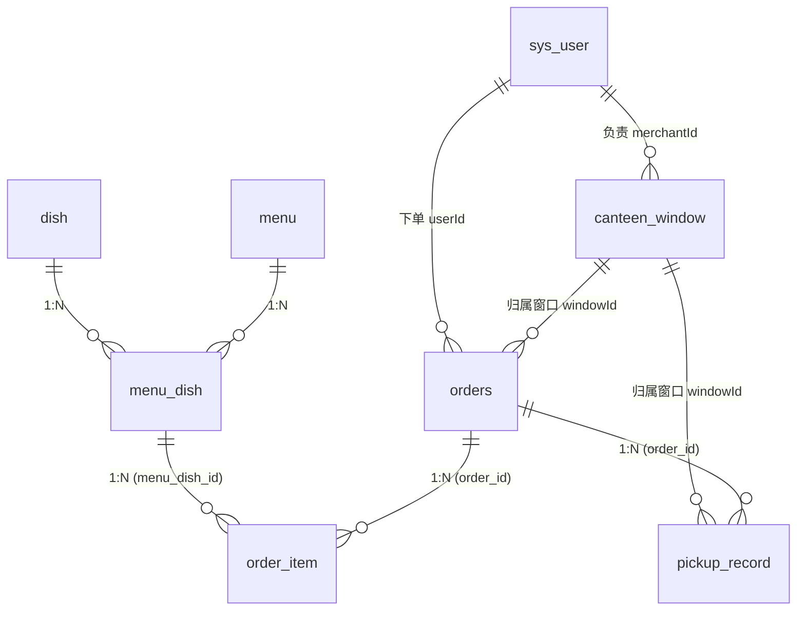
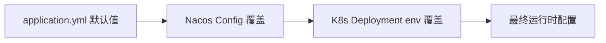

# 智能食堂点餐与取餐微服务系统 —— 概要设计说明书（HLD）

| 项目 | 内容 |
|------|------|
| 项目名称 | 智能食堂点餐与取餐微服务系统（smart-canteen） |
| 文档类型 | 概要设计说明书（HLD） |
| 文档版本 | v1.0 |
| 评分映射 | 课程评分细则·文档部分·软件工程文档（30 分）·概要设计说明书 |

---

## 1. 总体设计

### 1.1 系统分层



### 1.2 设计原则

| 原则 | 落地方式 |
|------|---------|
| 单一职责 | 5 个服务按业务领域拆分，每个服务唯一一个写库；下游服务只暴露领域 API |
| 无状态接入层 | Gateway 不存任何业务状态；JWT 自带身份信息 |
| 共用同一套响应协议 | `Result<T>` + `StatusCode` 业务码 |
| 配置外置 | 全部通过 Nacos / 环境变量；代码内不硬编码业务参数 |
| 数据强一致优先 | 库存扣减用数据库乐观锁；订单创建一致性靠本地事务 + 库存反向恢复 |

---

## 2. 子系统划分

### 2.1 模块清单

| 模块名 | Maven artifactId | 端口 | 主键依赖 |
|--------|------------------|------|---------|
| 公共组件 | `canteen-common` | — | Spring Boot Starter (web/jjwt) |
| 网关 | `canteen-gateway` | 8080 | spring-cloud-starter-gateway, alibaba-nacos-discovery, alibaba-nacos-config, jjwt |
| 用户服务 | `canteen-user-service` | 8081 | spring-boot-starter-web, mybatis-plus-spring-boot3-starter, mysql-connector-j, alibaba-nacos-*, jjwt, spring-security-crypto |
| 菜单服务 | `canteen-menu-service` | 8082 | spring-web, mybatis-plus, mysql, alibaba-nacos-* |
| 订单服务 | `canteen-order-service` | 8083 | 同 menu + spring-cloud-starter-openfeign + spring-scheduling |
| 取餐服务 | `canteen-pickup-service` | 8084 | 同 menu + openfeign + spring-boot-starter-data-redis + spring-boot-starter-websocket |
| 前端 | `smart-canteen-web` | 80（容器内） / 30173 NodePort | Vue 3, Vite 5, TS 5, Pinia, Element Plus, Axios |

### 2.2 服务包结构（Java 部分）

```text
canteen-common/
└── src/main/java/com/canteen/common/
    ├── result/         Result, StatusCode
    ├── exception/      BusinessException
    ├── util/           JwtUtil
    ├── constant/       RoleNames, UserHeaders
    └── entity/         BaseEntity

canteen-gateway/
└── src/main/java/com/canteen/gateway/
    ├── filter/         JwtAuthGlobalFilter
    └── config/         RateLimitProperties

canteen-user-service/
└── src/main/java/com/canteen/user/
    ├── controller/     UserController
    ├── service/        UserService
    ├── mapper/         UserMapper (MyBatis-Plus BaseMapper<User>)
    ├── entity/         User
    ├── dto/            RegisterDTO/LoginDTO/UserUpdateDTO/ChangePasswordDTO/AdminResetPasswordDTO
    ├── vo/             UserVO
    └── config/         GlobalExceptionHandler, MybatisPlusConfig

canteen-menu-service/
└── src/main/java/com/canteen/menu/
    ├── controller/     DishController, MenuBoardController
    ├── service/        DishService, DailyMenuService
    ├── mapper/         DishMapper, MenuMapper, MenuDishMapper
    ├── entity/         Dish, Menu, MenuDish
    ├── dto/            DishCreateDTO, MenuPublishDTO, StockOpDTO, StockUpdateDTO,
    │                  AdminMenuUpdateDTO, AdminMenuDishUpdateDTO
    ├── vo/             MenuDetailVO, MenuDishDetailVO, StockItemVO
    └── config/         GlobalExceptionHandler, MybatisPlus*

canteen-order-service/
└── src/main/java/com/canteen/order/
    ├── controller/     OrderController, StatController
    ├── service/        OrdersAppService, OrderPersistenceFacade
    ├── scheduler/      OrderTimeoutScheduler (@Scheduled fixedDelay=30s)
    ├── client/         MenuClient (Feign), PickupClient (Feign), client/dto/*
    ├── mapper/         OrderMapper, OrderItemMapper
    ├── entity/         CanteenOrder (TableName=orders), OrderItem
    ├── constant/       OrderStatus
    ├── dto/            CreateOrderDTO, OrderBatchStatusDTO
    ├── vo/             OrderVO, OrderBriefVO
    └── config/         GlobalExceptionHandler, MybatisMetaObjectHandler, MybatisPlusConfig

canteen-pickup-service/
└── src/main/java/com/canteen/pickup/
    ├── controller/     PickupController
    ├── service/        PickupQueueService
    ├── client/         OrderRemoteClient (Feign), client/dto/OrderBriefRemoteVO
    ├── mapper/         CanteenWindowMapper, PickupRecordMapper
    ├── entity/         CanteenWindow, PickupRecord
    ├── dto/            WindowCreateDTO, EnqueueBody, VerifyDTO
    ├── vo/             EnqueueResultVO, DisplayVO
    ├── websocket/      WebSocketConfig, QueueWebSocketHandler, WebSocketBroadcaster
    └── config/         GlobalExceptionHandler, MybatisPlus*
```

---

## 3. 数据库总体结构

### 3.1 库与表

| 数据库 | 表 | 说明 |
|--------|----|------|
| `canteen_user` | `sys_user` | 用户表，含角色 / 状态 / 软删除 |
| `canteen_menu` | `dish` | 菜品基础信息 |
| `canteen_menu` | `menu` | 每日菜单（含售卖时段） |
| `canteen_menu` | `menu_dish` | 菜单菜品关联表（含当日售价 / 库存 / 已售 / 状态） |
| `canteen_order` | `orders` | 订单主表 |
| `canteen_order` | `order_item` | 订单明细 |
| `canteen_pickup` | `canteen_window` | 取餐窗口 |
| `canteen_pickup` | `pickup_record` | 取餐排队历史记录 |

### 3.2 表 → 服务归属

| 表 | 写入归属 | 跨服务读取方式 |
|----|---------|----------------|
| sys_user | user-service | 不直接读 → 调 `/api/user/me` 等 |
| dish / menu / menu_dish | menu-service | order-service 通过 Feign `MenuClient` 访问 |
| orders / order_item | order-service | pickup-service 通过 Feign `OrderRemoteClient` 访问 |
| canteen_window / pickup_record | pickup-service | order-service 通过 Feign `PickupClient` 拿窗口列表 |

> 不允许跨库直接 `JOIN`。统计数据通过应用层组装（如订单服务调用 pickup-service 取窗口 → 再做订单条件查询）。

### 3.3 关键关系



### 3.4 数据 ID 策略

- 所有主键使用 MySQL `BIGINT UNSIGNED AUTO_INCREMENT`；
- 业务唯一键：`order_no` `pickup_code` `phone` `student_no` 均加 `UNIQUE` 索引；
- `pickupCode` 生成策略见详细设计 §6.1.6（6 位随机 + DB 唯一性查询，最多重试 15 次）。

### 3.5 软删除

- 所有业务表带 `deleted TINYINT DEFAULT 0`；
- MyBatis-Plus 全局配置 `logic-delete-field: deleted, logic-delete-value: 1, logic-not-delete-value: 0`；
- 物理删除仅限测试与初始化。

---

## 4. 主接口定义

完整路径基于 Gateway，全部为 `/api/...`，下游 controller 实际 URL 为去掉 `/api` 后的部分。

### 4.1 用户域（`/api/user/**`）

| Method | Path | Body / Query | 鉴权 | 说明 |
|--------|------|--------------|------|------|
| POST | `/api/user/register` | `RegisterDTO{ phone,password,nickname,studentNo }` | 匿名 | 注册 |
| POST | `/api/user/login` | `LoginDTO{ phone,password }` | 匿名 | 登录 |
| POST | `/api/user/refresh` | Header Authorization | Bearer | 刷新 Token |
| GET  | `/api/user/me` | — | Bearer | 当前用户 |
| PUT  | `/api/user/me` | `UserUpdateDTO{ nickname,avatar }` | Bearer | 修改自己的昵称/头像 |
| PUT  | `/api/user/me/password` | `ChangePasswordDTO{ oldPassword,newPassword }` | Bearer | 修改密码 |
| GET  | `/api/user/list` | `?page,size,role,status,phone,nickname,studentNo` | ADMIN | 用户分页查询 |
| PUT  | `/api/user/{id}/status` | `?value=0|1` | ADMIN | 启/禁用 |
| DELETE | `/api/user/{id}` | — | ADMIN | 删除（拒删管理员） |
| POST | `/api/user/{id}/reset-password` | `AdminResetPasswordDTO{ password }` | ADMIN | 重置密码 |

### 4.2 菜品域（`/api/dish/**`）

| Method | Path | Body / Query | 鉴权 |
|--------|------|--------------|------|
| POST | `/api/dish` | `DishCreateDTO{ name,description,price,image,category,stockThreshold? }` | MERCHANT/ADMIN |
| PUT | `/api/dish/{id}` | 同上 | MERCHANT/ADMIN（拒改：被生效菜单引用） |
| PUT | `/api/dish/{id}/status` | `?value=0|1` | MERCHANT/ADMIN |
| DELETE | `/api/dish/{id}` | — | MERCHANT/ADMIN |
| GET | `/api/dish/{id}` | — | Bearer |
| GET | `/api/dish/list` | `?page,size,merchantId,name,category,status,minPrice,maxPrice` | Bearer |

### 4.3 菜单域（`/api/menu/**`）

| Method | Path | Body / Query | 鉴权 |
|--------|------|--------------|------|
| POST | `/api/menu` | `MenuPublishDTO{ name,saleDate,startTime,endTime,items[{dishId,salePrice,stock}] }` | MERCHANT/ADMIN |
| GET | `/api/menu/today` | — | Bearer |
| GET | `/api/menu/{id}` | — | Bearer |
| PUT | `/api/menu/{id}` | `AdminMenuUpdateDTO` | ADMIN |
| PUT | `/api/menu/{id}/status` | `?value=0|1` | ADMIN |
| DELETE | `/api/menu/{id}` | — | ADMIN |
| GET | `/api/menu/list` | `?page,size,name,merchantId,saleDate,status,startDate,endDate` | Bearer |
| GET | `/api/menu/dish/{menuDishId}` | — | Bearer |
| PUT | `/api/menu/dish/{menuDishId}` | `AdminMenuDishUpdateDTO{ salePrice?,status? }` | ADMIN |
| GET | `/api/menu/stock/merchant` | `?page,size,keyword,status,menuId,dishId,saleDate` | MERCHANT |
| GET | `/api/menu/stock/list` | `?page,size,merchantId,keyword,status,menuId,dishId,saleDate,lowStockOnly` | ADMIN |
| PUT | `/api/menu/stock/{menuDishId}` | `StockUpdateDTO{ op:SET|INCR|DECR, value, reason? }` | MERCHANT/ADMIN |
| POST | `/api/menu/deduct` | `StockOpDTO{ menuDishId,quantity }` | 内部 |
| POST | `/api/menu/restore` | `StockOpDTO{ menuDishId,quantity }` | 内部 |

### 4.4 订单域（`/api/order/**`）

| Method | Path | Body / Query | 鉴权 |
|--------|------|--------------|------|
| POST | `/api/order` | `CreateOrderDTO{ windowId,remark?,items[{menuDishId,quantity}] }` | USER |
| GET | `/api/order/{id}` | — | USER（自己）/ADMIN |
| GET | `/api/order/my` | `?page,size` | USER |
| PUT | `/api/order/{id}/cancel` | — | USER（自己） |
| PUT | `/api/order/{id}/accept` | — | MERCHANT |
| PUT | `/api/order/{id}/cook` | — | MERCHANT |
| PUT | `/api/order/{id}/ready` | — | MERCHANT |
| PUT | `/api/order/{id}/pickup` | — | 内部（pickup 调用） |
| POST | `/api/order/{id}/remark` | `?remark=...` | MERCHANT |
| POST | `/api/order/batch/status` | `OrderBatchStatusDTO{ orderIds[],status }` | MERCHANT |
| GET | `/api/order/pickup-code/{code}` | — | Bearer |
| GET | `/api/order/merchant` | `?page,size,status,windowId,keyword,dateFrom,dateTo` | MERCHANT |
| GET | `/api/order/list` | `?page,size,status,merchantId,windowId,userId,keyword,dateFrom,dateTo` | ADMIN |

### 4.5 统计域（`/api/stat/**`）

| Method | Path | 鉴权 |
|--------|------|------|
| GET | `/api/stat/merchant/dashboard` | MERCHANT |
| GET | `/api/stat/admin/dashboard` | ADMIN |

### 4.6 取餐域（`/api/pickup/**`）

| Method | Path | Body / Query | 鉴权 |
|--------|------|--------------|------|
| POST | `/api/pickup/enqueue` | `EnqueueBody{ orderId,windowId }` | 内部 |
| POST | `/api/pickup/{wid}/call` | — | MERCHANT |
| POST | `/api/pickup/verify` | `VerifyDTO{ pickupCode }` | MERCHANT |
| GET | `/api/pickup/{wid}/queue` | — | Bearer |
| GET | `/api/pickup/{wid}/display` | — | Bearer |
| GET | `/api/pickup/windows` | `?page,size,status,merchantId,keyword` | Bearer |
| POST | `/api/pickup/window` | `WindowCreateDTO{ name,location,merchantId,pickupPrefix? }` | MERCHANT/ADMIN |
| PUT | `/api/pickup/window/{id}` | 同上 | ADMIN |
| PUT | `/api/pickup/window/{id}/status` | `?value=0|1` | ADMIN |
| DELETE | `/api/pickup/window/{id}` | — | ADMIN（拒删：活动订单未清） |
| GET | `/api/pickup/window/{id}/history` | — | Bearer |

### 4.7 WebSocket

| Path | 协议 | 说明 |
|------|------|------|
| `/ws/pickup` | ws / wss | 大屏端建立连接后被动接收叫号 / 核销消息；服务端不处理上行文本 |

消息格式见 [01-架构设计文档.md](01-架构设计文档.md) §5.5。

---

## 5. 通用组件

### 5.1 Result（统一响应体）

[Result.java](../../smart-canteen/canteen-common/src/main/java/com/canteen/common/result/Result.java) 提供 `success / error` 两类静态方法：

```java
public static <T> Result<T> success(T data);
public static <T> Result<T> error(StatusCode statusCode);
public static <T> Result<T> error(int code, String msg);
public boolean isSuccess();   // code == 200
```

字段：`code / msg / data / timestamp`。

### 5.2 StatusCode（业务码）

枚举 [StatusCode.java](../../smart-canteen/canteen-common/src/main/java/com/canteen/common/result/StatusCode.java)，3 段式（HTTP 通用 / 用户 / 库存 / 订单 / 取餐 / 数据冲突），每段有保留区间，避免冲突。

### 5.3 BusinessException

[BusinessException.java](../../smart-canteen/canteen-common/src/main/java/com/canteen/common/exception/BusinessException.java) 扩展 `RuntimeException`，携带 `StatusCode`。

### 5.4 GlobalExceptionHandler

每个服务都装载 `@RestControllerAdvice` 一份（结构一致，参考 order 服务的 [GlobalExceptionHandler.java](../../smart-canteen/canteen-order-service/src/main/java/com/canteen/order/config/GlobalExceptionHandler.java)），处理：

| 异常 | 输出 |
|------|------|
| `BusinessException` | `Result.error(code, msg)`，HTTP 200 |
| `MethodArgumentNotValidException / BindException` | `Result.error(400, fieldError)`，HTTP 200 |
| `DuplicateKeyException / DataIntegrityViolationException` | `Result.error(4090, "数据冲突")` |
| `HttpRequestMethodNotSupportedException` | `Result.error(400, "请求方法不支持")` |
| 其他 | `Result.error(StatusCode.ERROR)` |

> 设计选择：把业务异常包成 HTTP 200 是为了让前端只判断 `body.code`，避免分别处理 HTTP 错误码与业务错误码。

### 5.5 JwtUtil

[JwtUtil.java](../../smart-canteen/canteen-common/src/main/java/com/canteen/common/util/JwtUtil.java) 暴露：

```java
String generateToken(secret, expirationMillis, userId, username, role);
Claims parseToken(secret, token);                  // 失败抛 JwtException
Claims parseTokenAllowExpired(secret, token);      // 过期仍可读，用于 refresh
boolean validateToken(secret, token);              // gateway 用
Long getUserId(secret, token);
String getRole(secret, token);
```

Claims 结构：`{ userId, username, role, sub=userId, iat, exp }`。

### 5.6 RoleNames / UserHeaders

[RoleNames.java](../../smart-canteen/canteen-common/src/main/java/com/canteen/common/constant/RoleNames.java) 在 DB int role 与 token role 字符串之间转换：`0↔USER, 1↔MERCHANT, 2↔ADMIN`。
[UserHeaders.java](../../smart-canteen/canteen-common/src/main/java/com/canteen/common/constant/UserHeaders.java) 定义网关注入 Header 名称：`X-User-Id / X-Username / X-Role`。

### 5.7 BaseEntity

[BaseEntity.java](../../smart-canteen/canteen-common/src/main/java/com/canteen/common/entity/BaseEntity.java)：`id / createTime / updateTime / deleted`，所有业务实体继承。

### 5.8 Feign 客户端

| 客户端 | 所在服务 | 调用对象 |
|--------|---------|---------|
| `MenuClient` | order | 取菜单菜品详情、扣库存、恢复库存 |
| `PickupClient` | order | 取餐入队、窗口列表 |
| `OrderRemoteClient` | pickup | 按 pickupCode 取订单、订单状态置 PICKED |

每个 Feign 接口使用 `@FeignClient(name="...", contextId="...")` 显式区分 Bean，避免单服务多 Feign 接口冲突。

---

## 6. 部署拓扑与配置策略

### 6.1 环境矩阵

| 环境 | 启动方式 | 配置来源 | Nacos 地址 | 数据库地址 |
|------|---------|---------|-----------|-----------|
| 本地开发（IDEA） | 直接 Run | `application.yml`（Nacos 可选） | `127.0.0.1:8848` | `127.0.0.1:3320` |
| 容器化部署（K3S） | `kubectl apply` | YAML env + Nacos Config | `host.k3d.internal:8848` | `host.k3d.internal:3320` |

### 6.2 配置分层



Spring Boot 加载顺序：环境变量 > Nacos 远端 > application.yml。所以"运行时改地址"无须重新构建。

### 6.3 Nacos 中应有的 DataId

每个服务一个 DataId（见 [02-K3S部署方案说明.md](02-K3S部署方案说明.md) §2.5），内容覆盖：

- `spring.datasource.*`（K3S 部署时由 env 再次覆盖）
- `spring.cloud.nacos.discovery/config.server-addr`
- `spring.redis.host/port`
- `jwt.secret/expiration`（gateway / user）
- `rate-limit.*`（gateway）

### 6.4 服务启动顺序（生产 / 开发一致）

1. Nacos / MySQL / Redis（基础设施）
2. canteen-common 编译安装到本地 Maven（或父 POM 一次性 install）
3. canteen-gateway / user / menu / order / pickup（无强依赖，可任意顺序，但建议网关最后）
4. smart-canteen-web（前端）

> Spring Boot 在启动时若连接 Nacos 失败，因 `optional:` 前缀不会终止启动，方便服务先起再被发现。

---

## 7. 横切关注点

| 关注点 | 实现位置 |
|------|---------|
| 鉴权 | gateway 全局过滤器 + 下游 controller 角色二次校验 |
| 异常 | 各服务 `GlobalExceptionHandler` |
| 事务 | service 层 `@Transactional`（默认 REQUIRED） |
| 软删除 | MyBatis-Plus 全局 `logic-delete-field: deleted` |
| 日志 | `lombok.@Slf4j` + Spring Boot 默认 logback；定时任务异常 WARN |
| CORS | gateway `globalcors.cors-configurations` |
| WebSocket | pickup-service `WebSocketConfig.addHandler("/ws/pickup")`，gateway `lb:ws://...` 路由 |
| 时区 | JDBC URL `serverTimezone=Asia/Shanghai`；JVM 默认随宿主机 |

---

## 8. 设计冗余与折衷

| 决策 | 收益 | 折衷 |
|------|------|------|
| 数据库乐观锁 vs 分布式锁 | 简洁、性能好 | 无法控制热点行排队，理论上有"业务码 2002 偶现重试"概率 |
| HTTP 200 包业务码 vs HTTP 4xx | 前端单一判断逻辑 | 与 RESTful 习惯不完全一致；网关层 401/403 仍按 HTTP 状态码 |
| 单实例 WebSocket | 实现简单 | pickup 副本数受限为 1 |
| 多库物理隔离 vs 单库逻辑隔离 | 满足课程评分 + 服务自治 | 无法跨服务 JOIN，所有跨域查询需 Feign |
| Feign 同步调用 | 实现门槛低、可观测性好 | 食堂场景调用链短，无须 MQ；高并发场景需补熔断 |

---

## 9. 关联文档

- [03-需求规格说明书.md](03-需求规格说明书.md)：需求来源
- [05-详细设计说明书.md](05-详细设计说明书.md)：每个模块的内部实现
- [06-测试用例.md](06-测试用例.md) / [07-测试报告.md](07-测试报告.md)：验证主接口契约是否被实现正确
