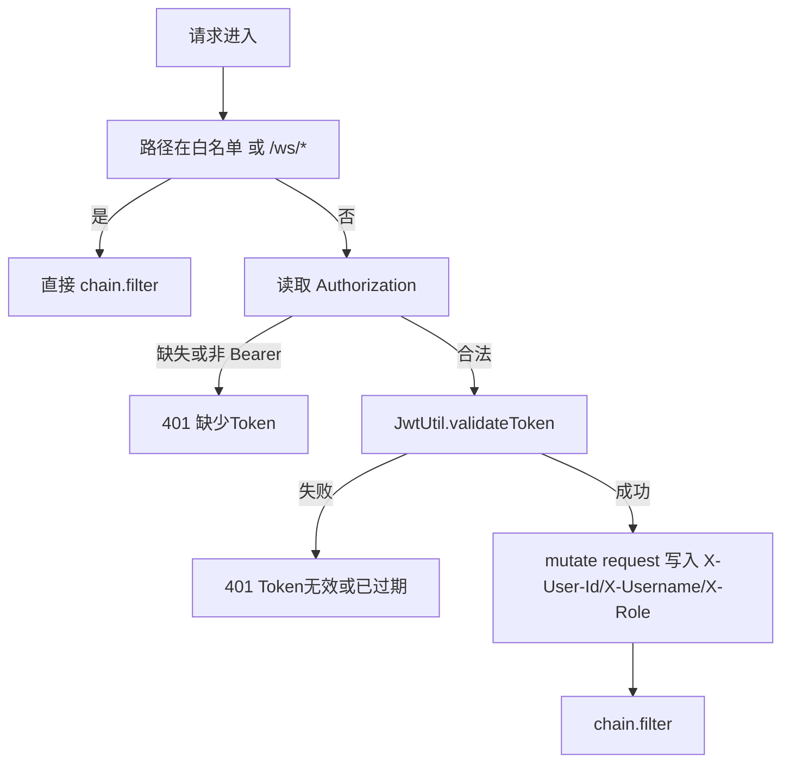
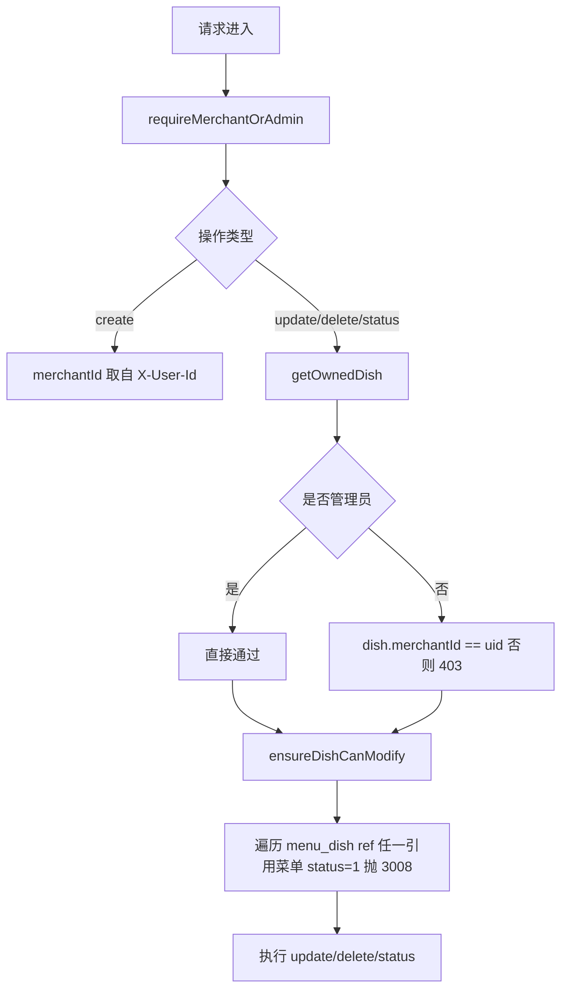
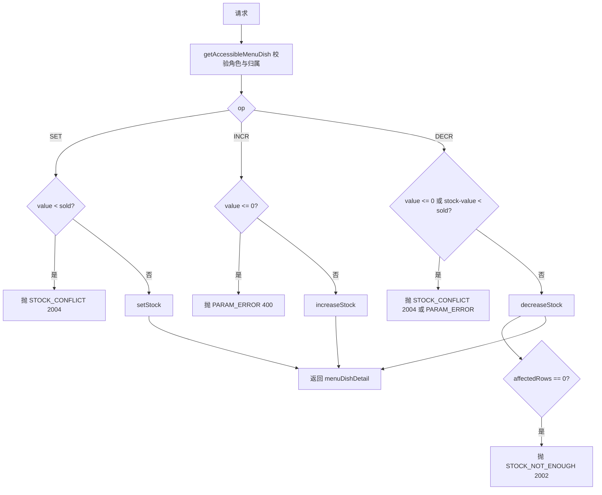
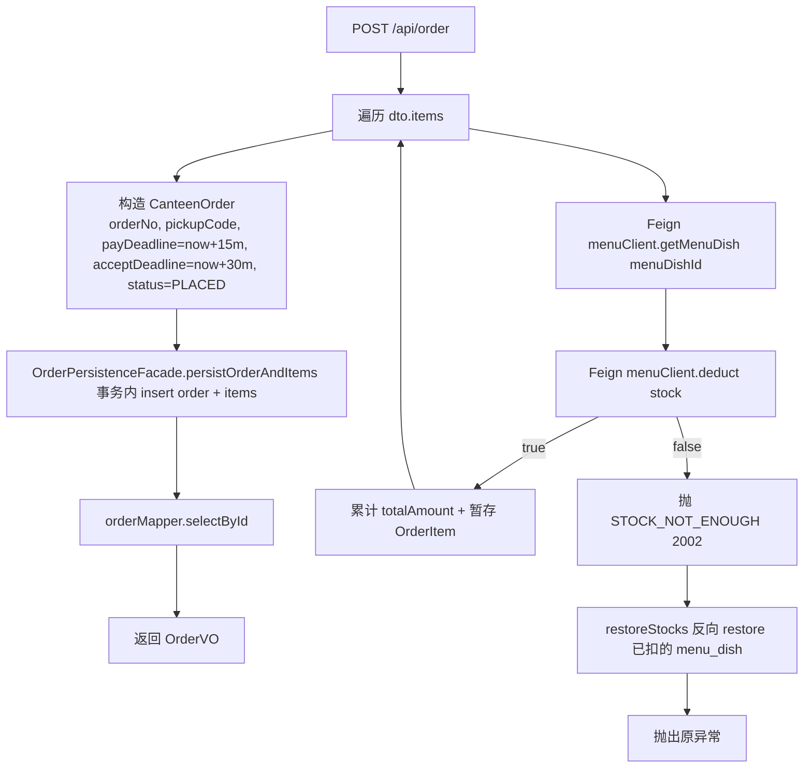
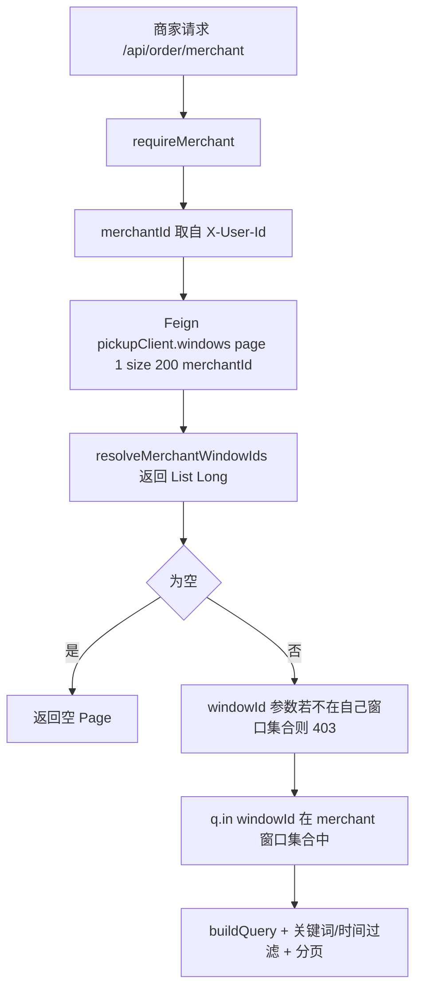
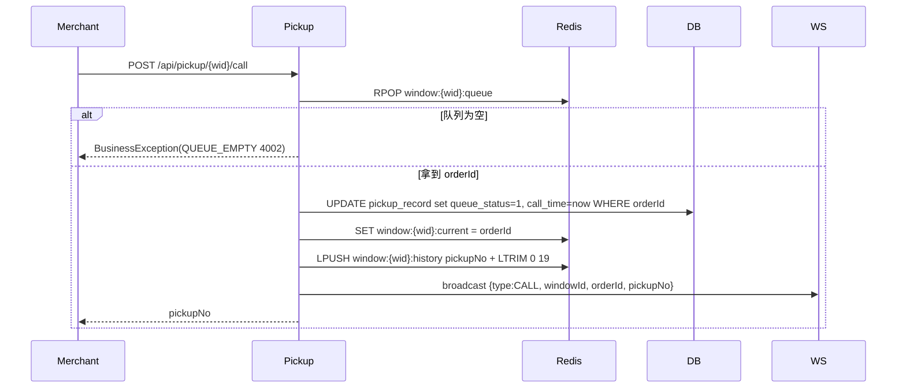
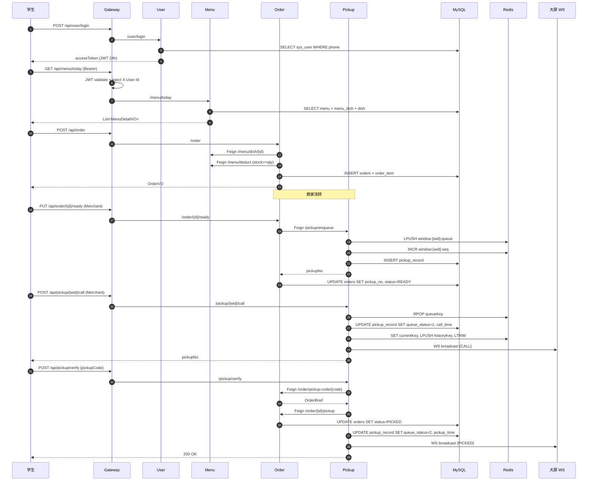

# 智能食堂点餐与取餐微服务系统 —— 详细设计说明书（LLD）

| 项目 | 内容 |
|------|------|
| 项目名称 | 智能食堂点餐与取餐微服务系统（smart-canteen） |
| 文档类型 | 详细设计说明书（LLD） |
| 文档版本 | v1.0 |
| 评分映射 | 课程评分细则·文档部分·软件工程文档（30 分）·详细设计说明书 |

> 本文按服务拆章，给出每个模块的内部数据结构、关键算法、接口参数与异常分支。横切关注点（鉴权、异常、配置）见 [04-概要设计说明书.md](04-概要设计说明书.md)。

---

## 目录

- [1. 公共组件（canteen-common）](#1-公共组件canteen-common)
- [2. 网关（canteen-gateway）](#2-网关canteen-gateway)
- [3. 用户服务（canteen-user-service）](#3-用户服务canteen-user-service)
- [4. 菜品菜单服务（canteen-menu-service）](#4-菜品菜单服务canteen-menu-service)
- [5. 订单服务（canteen-order-service）](#5-订单服务canteen-order-service)
- [6. 取餐服务（canteen-pickup-service）](#6-取餐服务canteen-pickup-service)
- [7. 前端关键设计要点](#7-前端关键设计要点)

---

## 1. 公共组件（canteen-common）

### 1.1 Result\<T\>

[Result.java](../../smart-canteen/canteen-common/src/main/java/com/canteen/common/result/Result.java)

```java
public class Result<T> {
    private Integer code;     // 业务码，与 StatusCode 同步
    private String msg;       // 文案
    private T data;           // 数据载荷，可为 null
    private Long timestamp;   // 服务端时间，毫秒

    public static <T> Result<T> success();
    public static <T> Result<T> success(T data);
    public static <T> Result<T> error(StatusCode statusCode);
    public static <T> Result<T> error(int code, String msg);
    public boolean isSuccess();
}
```

### 1.2 StatusCode

枚举定义见 [01-架构设计文档.md](01-架构设计文档.md) §5、[03-需求规格说明书.md](03-需求规格说明书.md) §5.2。值得说明的内部规则：

- `200/400/401/403/404/500` 共享 HTTP 通用语义；
- `1xxx` 用户域；`2xxx` 菜品 / 库存域；`3xxx` 订单 / 菜品被引用；`4xxx` 取餐 / 数据冲突；
- 业务码独占 `code`，`msg` 也由枚举给出，可被 `BusinessException(code, msg)` 覆写。

### 1.3 BusinessException

```java
public class BusinessException extends RuntimeException {
    private final StatusCode statusCode;
    public BusinessException(StatusCode statusCode);
    public BusinessException(StatusCode statusCode, String message);  // 自定义 msg，code 仍取 statusCode
    public BusinessException(String message);                          // code = ERROR(500)
}
```

### 1.4 JwtUtil

[JwtUtil.java](../../smart-canteen/canteen-common/src/main/java/com/canteen/common/util/JwtUtil.java) 关键算法：

| 方法 | 关键逻辑 |
|------|---------|
| `generateToken` | `iat = now`，`exp = now + expirationMillis`，`claims = { userId, username, role, sub=userId }`，签名算法 HMAC-SHA256（`Keys.hmacShaKeyFor(secret.getBytes(UTF_8))`） |
| `parseToken` | `Jwts.parser().verifyWith(key).build().parseSignedClaims(token).getPayload()` |
| `parseTokenAllowExpired` | 捕获 `ExpiredJwtException` 后返回其 `Claims`，专为 refresh 流程使用 |
| `validateToken` | `parseToken` 不抛异常即视为有效 |
| `getUserId / getUsername / getRole` | 从 claims 读取，`getUserId` 兼容数字、字符串与 sub 三种来源 |

### 1.5 RoleNames / UserHeaders / BaseEntity

| 组件 | 作用 |
|------|------|
| `RoleNames` | `USER / MERCHANT / ADMIN` 三常量 + DB int ↔ token string 双向映射 |
| `UserHeaders` | 三个常量字符串：`X-User-Id / X-Username / X-Role` |
| `BaseEntity` | `id / createTime / updateTime / deleted`；MyBatis-Plus 自动填充由 `MybatisMetaObjectHandler` 处理（见各服务 config 包） |

---

## 2. 网关（canteen-gateway）

### 2.1 启动入口

`GatewayApplication`：标准 `@SpringBootApplication`，无 `@EnableXxx` 额外注解，路由完全由配置驱动。

### 2.2 路由配置

来自 [application.yml](../../smart-canteen/canteen-gateway/src/main/resources/application.yml)，核心片段：

```yaml
spring:
  cloud:
    gateway:
      routes:
        - id: user-service
          uri: lb://canteen-user-service
          predicates:
            - Path=/api/user/**
          filters:
            - StripPrefix=1
        ...
        - id: pickup-websocket
          uri: lb:ws://canteen-pickup-service
          predicates:
            - Path=/ws/pickup/**
```

7 条路由：`user / dish / menu / order / stat / pickup / pickup-websocket`。`StripPrefix=1` 会把首段 `/api` 去掉再转发；WebSocket 路由不带 StripPrefix（pickup-service 自身就在 `/ws/pickup` 注册 handler）。

### 2.3 全局过滤器 JwtAuthGlobalFilter

[JwtAuthGlobalFilter.java](../../smart-canteen/canteen-gateway/src/main/java/com/canteen/gateway/filter/JwtAuthGlobalFilter.java)



关键点：

- 白名单：`/api/user/register`、`/api/user/login`、`/api/user/refresh`，使用 `AntPathMatcher` 匹配；
- WebSocket：路径以 `/ws/` 开头直接放行，业务侧不二次校验；
- 失败时构造 `Result.error(401, msg)` 并以原生 JSON 写入响应体（不依赖 Jackson），HTTP 状态码 401；
- `getOrder()` 返回 `-100`，确保在 `LoadBalancerClientFilter` 等内置过滤器之前执行。

### 2.4 限流配置（占位）

[RateLimitProperties.java](../../smart-canteen/canteen-gateway/src/main/java/com/canteen/gateway/config/RateLimitProperties.java) 把 `rate-limit.*` 映射为 Bean，但当前未注册具体的限流过滤器实现。配置项：

```yaml
rate-limit:
  ip-limit: 100        # 每窗口每 IP 请求数
  user-limit: 30       # 每窗口每用户请求数
  bucket-size: 10000   # 滑动窗口最大桶数
  window-buckets: 6    # 一个窗口包含的桶数
```

> 将这些值放在 Nacos 中可在线热更，供后续接入限流过滤器（如基于 Redis Token Bucket）使用。

### 2.5 跨域

`spring.cloud.gateway.globalcors.cors-configurations` 全局允许任意 origin / method / header，且 `allowCredentials: true`。

---

## 3. 用户服务（canteen-user-service）

### 3.1 数据模型

#### `sys_user` 表 → `User` 实体

| 字段 | 类型 | 含义 |
|------|------|------|
| id | BIGINT | 主键 |
| student_no | VARCHAR(32) UNIQUE | 学工号（可空） |
| phone | VARCHAR(20) UNIQUE | 手机号（必填，登录用） |
| password | VARCHAR(128) | BCrypt 密文 |
| nickname | VARCHAR(64) | 显示名 |
| avatar | VARCHAR(255) | 头像 URL |
| role | TINYINT | 0/1/2 |
| status | TINYINT | 0 禁用 / 1 正常 |
| create_time / update_time / deleted | — | 通用字段 |

### 3.2 关键流程

#### 3.2.1 注册

[UserService.register](../../smart-canteen/canteen-user-service/src/main/java/com/canteen/user/service/UserService.java)：

```java
@Transactional
public void register(RegisterDTO dto) {
    if (countByPhone(dto.getPhone()) > 0) throw BusinessException(USER_EXISTS);
    if (hasText(dto.getStudentNo()) && countByStudentNo() > 0) throw BusinessException(USER_EXISTS);

    User user = new User();
    user.setPhone(dto.getPhone());
    user.setStudentNo(dto.getStudentNo());
    user.setPassword(passwordEncoder.encode(dto.getPassword()));   // BCrypt
    user.setNickname(hasText(dto.getNickname()) ? dto.getNickname() : dto.getPhone());
    user.setRole(0);
    user.setStatus(1);
    userMapper.insert(user);
}
```

异常分支：

- `1003 USER_EXISTS`：手机号 / 学工号冲突；
- `4090 DUPLICATE_KEY`：Mapper 触发 DB 唯一约束冲突时由全局异常处理器兜底（防并发注册）。

#### 3.2.2 登录

```java
public Map<String, Object> login(LoginDTO dto) {
    User user = userMapper.selectOne(eq(User::getPhone, dto.getPhone()));
    if (user == null) throw BusinessException(USER_NOT_FOUND);          // 1002
    if (status == 0) throw BusinessException(FORBIDDEN);                // 403
    if (!passwordEncoder.matches(dto.getPassword(), user.getPassword()))
        throw BusinessException(PASSWORD_ERROR);                         // 1004

    String token = JwtUtil.generateToken(jwtSecret, jwtExpirationMs,
            user.getId(), nickname, RoleNames.fromDbRole(user.getRole()));
    return Map.of("accessToken", token, "tokenType", "Bearer",
                  "expiresIn", jwtExpirationMs/1000,
                  "userId", user.getId(), "role", user.getRole());
}
```

#### 3.2.3 Token 刷新

[UserService.refresh](../../smart-canteen/canteen-user-service/src/main/java/com/canteen/user/service/UserService.java) 关键逻辑：

```java
Claims claims = JwtUtil.parseTokenAllowExpired(jwtSecret, token);  // 过期允许
if (claims.getExpiration().toInstant().plus(7, DAYS).isBefore(now()))
    throw BusinessException(TOKEN_EXPIRED);                         // 1005

User user = userMapper.selectById(claims.userId);
if (user == null || status == 0) throw BusinessException(USER_NOT_FOUND);

return generateNewToken(user);
```

策略：超过过期时刻 7 天后再来刷新视为永久过期，要求重新登录。

#### 3.2.4 修改密码

```java
@Transactional
public void changePassword(...) {
    require oldPassword 匹配 → 否则 1004
    require newPassword != oldPassword → 否则 400
    user.setPassword(BCrypt(new))
}
```

#### 3.2.5 管理员操作（list / status / delete / reset-password）

- 入口先 `requireAdmin(request)`（校验 `X-Role == ADMIN`），否则抛 `403 FORBIDDEN`；
- 删除时硬保护：`role == 2` 的账号不允许删除（[UserService.deleteUser](../../smart-canteen/canteen-user-service/src/main/java/com/canteen/user/service/UserService.java)）。

### 3.3 接口契约（DTO/VO）

| DTO/VO | 字段（重点） | 校验 |
|--------|-------------|------|
| `RegisterDTO` | phone, password, nickname?, studentNo? | phone `@NotBlank`；password 6–20 |
| `LoginDTO` | phone, password | `@NotBlank` |
| `UserUpdateDTO` | nickname?, avatar? | — |
| `ChangePasswordDTO` | oldPassword, newPassword | 同 RegisterDTO 规则 |
| `AdminResetPasswordDTO` | password | 6–20 |
| `UserVO` | id, studentNo, phone, nickname, avatar, role, status | 不返回 password |

---

## 4. 菜品菜单服务（canteen-menu-service）

### 4.1 数据模型

| 表 | 关键列 | 备注 |
|----|-------|------|
| `dish` | merchant_id, name, price, category, status, stock_threshold | 长期信息 |
| `menu` | name, sale_date, start_time, end_time, status | 一天可有多个时段菜单 |
| `menu_dish` | menu_id, dish_id, sale_price, stock, sold, status；唯一键 `uk_menu_dish(menu_id, dish_id)` | 库存最小单位 |

### 4.2 菜品 CRUD（DishService）

[DishService.java](../../smart-canteen/canteen-menu-service/src/main/java/com/canteen/menu/service/DishService.java) 关键逻辑：



要点：

- **被生效菜单引用保护**：`ensureDishCanModify` 在更新 / 下架 / 删除前遍历引用，命中 `menu.status == 1` 即抛 `DISH_MENU_CONFLICT(3008)`；
- **越权防护**：商家只能改自己创建的菜品（按 `dish.merchantId` 校验）。

### 4.3 菜单发布与今日菜单（DailyMenuService）

#### 4.3.1 发布

```java
@Transactional
public Menu publish(MenuPublishDTO dto) {
    insert menu (status=1)
    for each item in dto.items:
        insert menu_dish(menuId, dishId, salePrice, stock, sold=0, status=1)
}
```

#### 4.3.2 今日菜单

```java
public List<MenuDetailVO> todayMenus() {
    LocalDate today = LocalDate.now();
    LocalTime now = LocalTime.now();
    List<Menu> all = menuMapper.selectList(eq(saleDate, today).eq(status, 1));
    return all.stream()
              .filter(m -> !now.isBefore(m.startTime) && !now.isAfter(m.endTime))
              .map(m -> buildDetail(m.id))
              .toList();
}
```

`buildDetail` 二级查询关联 `menu_dish` + `dish` 拼出 `MenuDetailVO`，并冗余出 `merchantId / merchantName`（"merchant-{id}" 占位，前端可继续解析为真名）。

### 4.4 库存操作（核心算法）

#### 4.4.1 SQL 级原子操作

`MenuDishMapper` 内置 5 条带条件的 `UPDATE`，全部带 `deleted = 0` 软删除约束：

```sql
-- 下单扣减（乐观锁）
UPDATE menu_dish SET stock = stock - #{qty}, sold = sold + #{qty}
WHERE id = #{id} AND deleted = 0 AND stock >= #{qty};

-- 取消恢复
UPDATE menu_dish SET stock = stock + #{qty}, sold = sold - #{qty}
WHERE id = #{id} AND deleted = 0 AND sold >= #{qty};

-- SET：直接置库存
UPDATE menu_dish SET stock = #{stock} WHERE id = #{id} AND deleted = 0;

-- INCR：增加库存
UPDATE menu_dish SET stock = stock + #{delta} WHERE id = #{id} AND deleted = 0;

-- DECR：减少库存（保护不能负）
UPDATE menu_dish SET stock = stock - #{delta} WHERE id = #{id} AND deleted = 0 AND stock >= #{delta};
```

#### 4.4.2 库存调整业务流（updateStock）

[DailyMenuService.updateStock](../../smart-canteen/canteen-menu-service/src/main/java/com/canteen/menu/service/DailyMenuService.java)：



#### 4.4.3 内部接口 deduct / restore

```java
public boolean deduct(...) {
    requireInternalOrPrivileged(request);
    return menuDishMapper.deductStock(...) > 0;
}
```

`requireInternalOrPrivileged` 接受三类来源：

1. Header `X-Internal-Call: true`（保留给后续内网直连）
2. role 为 ADMIN / MERCHANT；
3. role 为空（来自 Feign 调用时下游可能没有携带 X-Role，开发期默认放行）。

---

## 5. 订单服务（canteen-order-service）

### 5.1 启动注解

[OrderServiceApplication.java](../../smart-canteen/canteen-order-service/src/main/java/com/canteen/order/OrderServiceApplication.java)：

```java
@SpringBootApplication
@MapperScan("com.canteen.order.mapper")
@EnableFeignClients(basePackages = "com.canteen.order.client")
@EnableScheduling
```

### 5.2 数据模型

#### `orders` 表 → `CanteenOrder`（`@TableName("orders")`）

字段同 [03-需求规格说明书.md](03-需求规格说明书.md) §6 ER 图。`pickupCode` 全局唯一索引。

#### `order_item` 表 → `OrderItem`

`order_id, dish_id, menu_dish_id, dish_name, quantity, unit_price, subtotal`。

### 5.3 状态机常量

[OrderStatus.java](../../smart-canteen/canteen-order-service/src/main/java/com/canteen/order/constant/OrderStatus.java)：

```java
public final class OrderStatus {
    public static final int PLACED    = 0;
    public static final int ACCEPTED  = 1;
    public static final int COOKING   = 2;
    public static final int READY     = 3;
    public static final int PICKED    = 4;
    public static final int CANCELLED = 5;
}
```

### 5.4 核心流程

#### 5.4.1 下单（create）

[OrdersAppService.create](../../smart-canteen/canteen-order-service/src/main/java/com/canteen/order/service/OrdersAppService.java) 算法：



要点：

- **失败回滚**：`try { ... } catch (BusinessException|RuntimeException) { restoreStocks(rolledBack); throw; }` —— 即使 `Persist` 阶段抛错，也能保证已经扣除的库存被恢复。
- **orderNo / pickupCode 生成**：

```java
String orderNo  = "O" + yyyyMMdd + 4位随机数;       // 例：O202604280123
String pickupCode = 6位随机 100000-999999，DB 唯一性检查 15 次重试
```

- **超时时间**：`payDeadline = now + 15min`、`acceptDeadline = now + 30min`，由调度任务消费。

#### 5.4.2 状态流转（accept / cook / ready）

```java
@Transactional
public void accept(...) {
    requireMerchant(request);
    Order o = loadOrder(id);
    if (o.status != PLACED)   throw 3002;
    o.status = ACCEPTED;
}
@Transactional
public void cook(...) {
    if (o.status != ACCEPTED) throw 3002;
    o.status = COOKING;
}
@Transactional
public void ready(...) {
    if (o.status != COOKING)  throw 3002;
    o.status = READY;
    EnqueueResultVO r = pickupClient.enqueue(orderId, windowId);   // Feign 调取餐
    if (!r.success) throw 500;
    o.pickupNo = r.pickupNo;
}
```

#### 5.4.3 取消与超时

| 触发 | 方法 | cancelType |
|------|------|-----------|
| 用户主动 | `userCancel` | 1 |
| 调度任务 | `timeoutCancelBatch` | 2 |

`cancelOrder` 通用实现：

```java
o.status = CANCELLED; o.cancelType = type; o.cancelTime = now;
for each OrderItem with menuDishId:
    menuClient.restore(menuDishId, quantity);
```

调度任务：

```java
@Scheduled(fixedDelay = 30_000)
void cancelStaleOrders() {
    try { ordersAppService.timeoutCancelBatch(); }
    catch (Exception e) { log.warn(...); }
}
```

`timeoutCancelBatch` 一次最多处理 100 条 `PLACED` 且 `payDeadline < now` 或 `acceptDeadline < now` 的订单。

#### 5.4.4 取餐回调（pickupCallback）

```java
@Transactional
public void pickupCallback(Long orderId) {
    Order o = orderMapper.selectById(orderId);
    if (o == null) throw 3001;
    if (o.status != READY) throw 3002;
    o.status = PICKED;
}
```

由 pickup-service 在 `verify` 成功时通过 `OrderRemoteClient.pickupDone(orderId)` 调用。

#### 5.4.5 商家订单分页（merchantOrders）



要点：

- **跨服务过滤**：商家只能看自己窗口的订单。窗口归属由 pickup-service 维护，订单服务通过 Feign 拿到窗口 ID 列表后做 `WHERE window_id IN (...)`。
- **关键词模糊匹配**：`order_no`、`pickup_code`、`order_item.dish_name` 三路 `OR` 合并（`buildQuery`）。

#### 5.4.6 统计大盘

商家：`{ totalOrders, placedOrders, readyOrders, doneOrders }` 全部按"自己窗口集合"做 count；管理员：跨全部订单 count。

---

## 6. 取餐服务（canteen-pickup-service）

### 6.1 启动注解

```java
@SpringBootApplication
@MapperScan("com.canteen.pickup.mapper")
@EnableFeignClients(basePackages = "com.canteen.pickup.client")
```

未启用 `@EnableScheduling`（无定时任务）。

### 6.2 数据模型

| 表 | 字段（重点） |
|----|-------------|
| `canteen_window` | name, location, merchant_id, status (0关闭/1营业), pickup_prefix（默认 `A`） |
| `pickup_record` | order_id, window_id, pickup_no, queue_status (0等待/1已叫/2已取)，queue_time / call_time / pickup_time |

### 6.3 关键算法（PickupQueueService）

[PickupQueueService.java](../../smart-canteen/canteen-pickup-service/src/main/java/com/canteen/pickup/service/PickupQueueService.java)

#### 6.3.1 入队（enqueue）

```java
public EnqueueResultVO enqueue(EnqueueBody body) {
    Window w = windowMapper.selectById(wid);
    if (w == null || w.status == 0) throw NOT_FOUND;

    Long seq = redis.opsForValue().increment("window:" + wid + ":seq");
    String prefix = StringUtils.hasText(w.pickupPrefix) ? w.pickupPrefix : "A";
    String pickupNo = prefix + String.format("%03d", seq % 1000);  // 例 A001

    redis.opsForList().leftPush(queueKey(wid), String.valueOf(orderId));

    PickupRecord pr = new PickupRecord();
    pr.orderId = orderId; pr.windowId = wid; pr.pickupNo = pickupNo;
    pr.queueStatus = QUEUE_WAITING; pr.queueTime = LocalDateTime.now();
    pickupRecordMapper.insert(pr);
    return new EnqueueResultVO(pickupNo);
}
```

注意 `seq % 1000` 后只取 3 位：业务设计中"取餐号循环"，A001…A999 之后回到 A001（前一组通常已被取餐）。

#### 6.3.2 叫号（call）



#### 6.3.3 核销（verify）

```java
@Transactional
public void verify(VerifyDTO dto) {
    Result<OrderBriefRemoteVO> res = orderRemoteClient.findByPickupCode(dto.pickupCode);
    if (!res.success || res.data == null) throw PICKUP_VERIFY_FAILED(4003);
    if (res.data.status != READY) throw ORDER_STATUS_ERROR(3002);

    Result<Void> done = orderRemoteClient.pickupDone(res.data.id);
    if (!done.success) throw ERROR(500);

    PickupRecord pr = lastRecordOf(orderId);
    pr.queueStatus = QUEUE_PICKED; pr.pickupTime = now;
    pickupRecordMapper.updateById(pr);

    broadcast({type:"PICKED", orderId, pickupNo});
}
```

#### 6.3.4 大屏 display 数据

```java
DisplayVO {
    windowId,
    currentPickupNo: 通过 currentKey + DB 反查 pickup_record,
    currentOrderId: currentKey 解析,
    waitingCount: redis LLEN queueKey,
    waitingOrderIds: redis LRANGE 0 -1,
    recentCalls: redis LRANGE historyKey 0 19
}
```

### 6.4 窗口管理

| 接口 | 角色 | 关键校验 |
|------|------|---------|
| 创建 | MERCHANT/ADMIN | 默认 prefix=A，status=1 |
| 修改 / 改状态 / 删除 | ADMIN | 删除时 `pickup_record.queue_status IN (0,1)` count > 0 → 抛 `4090 数据冲突 "窗口有活动订单，不能删除"` |

### 6.5 WebSocket

```java
@Configuration
@EnableWebSocket
public class WebSocketConfig implements WebSocketConfigurer {
    public void registerWebSocketHandlers(WebSocketHandlerRegistry r) {
        r.addHandler(queueWebSocketHandler, "/ws/pickup").setAllowedOrigins("*");
    }
}
```

`QueueWebSocketHandler`（继承 `TextWebSocketHandler`）：

- `afterConnectionEstablished` → `broadcaster.register(session)`；
- `afterConnectionClosed` → `broadcaster.unregister(session)`；
- `handleTextMessage` no-op（单向推送）。

`WebSocketBroadcaster` 使用 `CopyOnWriteArraySet<WebSocketSession>` 维护会话集合，遍历推送时对 `synchronized(session)` 串行化写入，规避 Spring 限制下的"已在写时再次写"异常。

---

## 7. 前端关键设计要点

> 前端不在课程评分文档要求范围内，但其设计影响接口契约。这里仅列出与后端联调相关的关键约束。

### 7.1 请求封装

`smart-canteen-web/src/utils/request.ts`（Axios 实例）：

- 统一加 `Authorization: Bearer <token>`（token 取自 Pinia auth store）；
- 统一 `baseURL: /api`（开发期由 Vite 代理到 `127.0.0.1:8080`）；
- 响应拦截：先看 HTTP 状态，再看 `body.code`：`code !== 200` → `Promise.reject(body)`；
- 401 错误尝试静默 refresh 一次，失败则跳登录页。

### 7.2 状态管理

- `stores/auth.ts` 持久化 `accessToken / userId / role / nickname`；
- 登录成功 / refresh 成功后写入；登出清空。

### 7.3 WebSocket 客户端（大屏）

`PickupDisplayView.vue` 通过 `new WebSocket("ws://host:port/ws/pickup")` 建立连接：

- `onmessage` 解析 JSON，根据 `type === "CALL" / "PICKED"` 更新 UI；
- 断线后 3 秒重连。

### 7.4 路由守卫

`router/index.ts`：

- `/login`、`/register`、`/display` 不需要登录；
- 其他路由进入前检查 token；管理员/商家路由额外校验 role。

---

## 8. 关键时序总览（汇总）



---

## 9. 模块详细设计文件索引

| 服务 | 关键源码文件 |
|------|-------------|
| 公共 | [Result.java](../../smart-canteen/canteen-common/src/main/java/com/canteen/common/result/Result.java) / [StatusCode.java](../../smart-canteen/canteen-common/src/main/java/com/canteen/common/result/StatusCode.java) / [JwtUtil.java](../../smart-canteen/canteen-common/src/main/java/com/canteen/common/util/JwtUtil.java) |
| 网关 | [JwtAuthGlobalFilter.java](../../smart-canteen/canteen-gateway/src/main/java/com/canteen/gateway/filter/JwtAuthGlobalFilter.java) / [application.yml](../../smart-canteen/canteen-gateway/src/main/resources/application.yml) |
| 用户 | [UserController.java](../../smart-canteen/canteen-user-service/src/main/java/com/canteen/user/controller/UserController.java) / [UserService.java](../../smart-canteen/canteen-user-service/src/main/java/com/canteen/user/service/UserService.java) |
| 菜品菜单 | [DishController.java](../../smart-canteen/canteen-menu-service/src/main/java/com/canteen/menu/controller/DishController.java) / [MenuBoardController.java](../../smart-canteen/canteen-menu-service/src/main/java/com/canteen/menu/controller/MenuBoardController.java) / [DailyMenuService.java](../../smart-canteen/canteen-menu-service/src/main/java/com/canteen/menu/service/DailyMenuService.java) / [MenuDishMapper.java](../../smart-canteen/canteen-menu-service/src/main/java/com/canteen/menu/mapper/MenuDishMapper.java) |
| 订单 | [OrderController.java](../../smart-canteen/canteen-order-service/src/main/java/com/canteen/order/controller/OrderController.java) / [StatController.java](../../smart-canteen/canteen-order-service/src/main/java/com/canteen/order/controller/StatController.java) / [OrdersAppService.java](../../smart-canteen/canteen-order-service/src/main/java/com/canteen/order/service/OrdersAppService.java) / [OrderTimeoutScheduler.java](../../smart-canteen/canteen-order-service/src/main/java/com/canteen/order/scheduler/OrderTimeoutScheduler.java) / [MenuClient.java](../../smart-canteen/canteen-order-service/src/main/java/com/canteen/order/client/MenuClient.java) / [PickupClient.java](../../smart-canteen/canteen-order-service/src/main/java/com/canteen/order/client/PickupClient.java) |
| 取餐 | [PickupController.java](../../smart-canteen/canteen-pickup-service/src/main/java/com/canteen/pickup/controller/PickupController.java) / [PickupQueueService.java](../../smart-canteen/canteen-pickup-service/src/main/java/com/canteen/pickup/service/PickupQueueService.java) / [WebSocketConfig.java](../../smart-canteen/canteen-pickup-service/src/main/java/com/canteen/pickup/websocket/WebSocketConfig.java) / [WebSocketBroadcaster.java](../../smart-canteen/canteen-pickup-service/src/main/java/com/canteen/pickup/websocket/WebSocketBroadcaster.java) |
